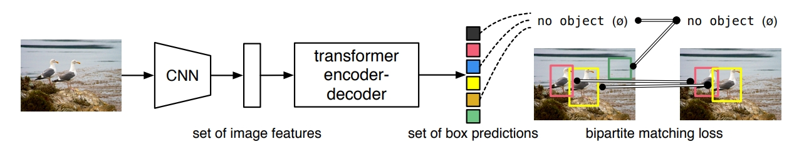
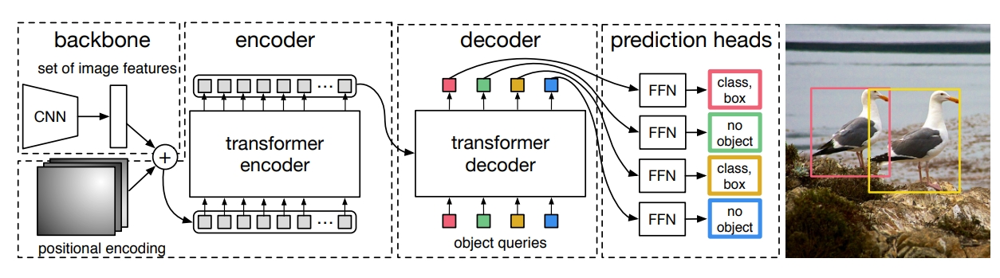
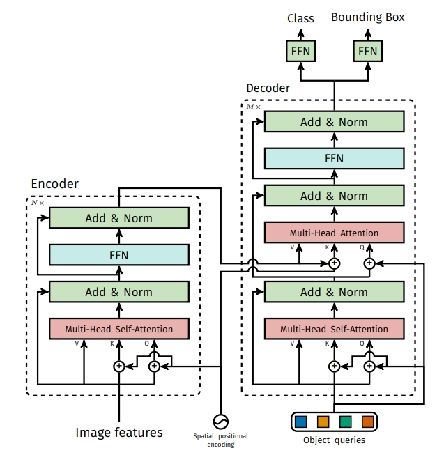
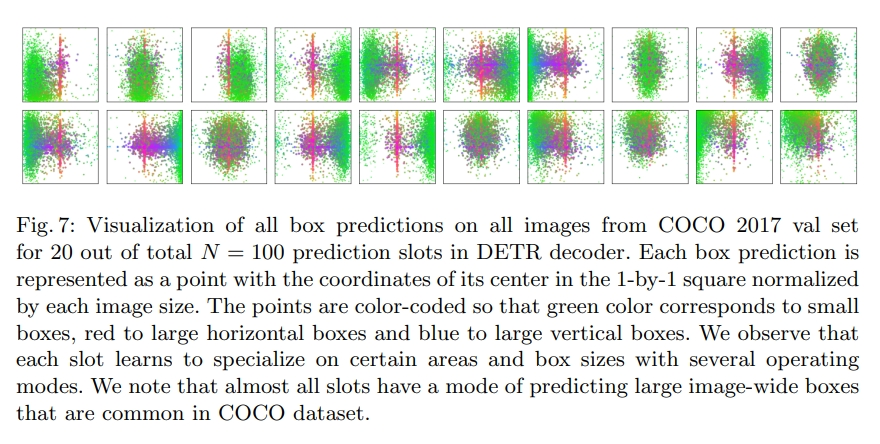

# DETR

论文[End-to-End Object Detection with Transformers](https://arxiv.org/abs/2005.12872)

DETR全程为Detection Transformer，如其名是一个在目标检测上运用transformer的模型。

文章所做的工作，就是将transformers运用到了object detection领域，取代了现在的模型需要手工设计的工作，并且取得了不错的结果。主要是取消NMS等后处理，和锚框等先验知识的手工过程。

上图可以直接看出模型主要的流程设计：

1. CNN提取特征并拉直
2. 全局建模，给到transformer-encoder去进一步学习全局信息
3. 通过不带掩码机制的transformer-decoder生成很多预测框
4. 预测框和真实框做二分图匹配，训练时计算loss去除多余背景框，推理时无需这步可以直接使用阈值去除多余框。

## 模型结构

可以看出模型主要是由backbone，encoder，decoder，prediction heads四部分组成。

### backbone

backbone可以是大部分目标检测的CNN主干模型，作者使用ResNet50。

一个例子，图片输入为3x800x1066，经过CNN卷积之后得到2048x25x34(c,h,w)的特征图，然后作者使用1x1卷积降维为256x25x34(d,h,w)方便进入transformer进行相关处理。

### encoder

encoder部分为transformer-encoder，相关的模型内容和transformer是相同的，每个encoder块都是由多头自注意模块和FFN组成。

只在输入前加入了位置编码使transformer可以获得其本身无法获得的相关的位置信息。

位置编码是一个固定的256x25x34(d,h,w)，使其可以和之前卷积出的特征图相加。

相加之后将向量的h和w拉直成850x256(hw,d)的向量，将其输入到transformer-encoder中，输出850x256的结果。

其中DETR中使用了6层encoder。

### decoder

在decoder部分，作者在transformer基础的自注意力和FFN结构的decoder上，加入了object queries的learnable positional embedding，做cross attention。

下图是作者将object query经过COCO训练集后进行可视化的结构，绿色为小框中心点，红色为横向框中心点，蓝色为纵向框中心点。

从中我们可以窥见object query做的工作其实就是询问encoder的输出中有没有对应的框，比如我的绿色部分有小物体吗，红色部分有大的横向物体吗。100个query就有100种问问题方式进行询问，然后根据询问结果进行decoder的输出。此外我们还可以看到几乎每个query中间都有红色的点，作者认为这是数据集中间总是有一个大物体的训练结果。

object queries为100x256(n,b)即要生成的100个目标的框和输入张量的256的长度。将其和encoder输出的850x256的向量做自注意力和FFN的操作，得到decoder的输出为100x256的向量。

其中DETR中使用了6层decoder。

### prediction head

检测头部分则是FFN来预测分类和框，且DETR中生成100个框，所以检测头也有100个。其输出为100x91即100个框和class+1个分类的向量。

## 损失函数

## 参考

[DETR 论文精读【论文精读】](https://www.bilibili.com/video/BV1GB4y1X72R/)

[图像生成发展起源：从VAE、VQ-VAE、扩散模型DDPM、DETR到ViT、Swin transformer](https://blog.csdn.net/v_JULY_v/article/details/130361959)

[Vision Transformer 超详细解读 (原理分析+代码解读) (一)](https://zhuanlan.zhihu.com/p/340149804)