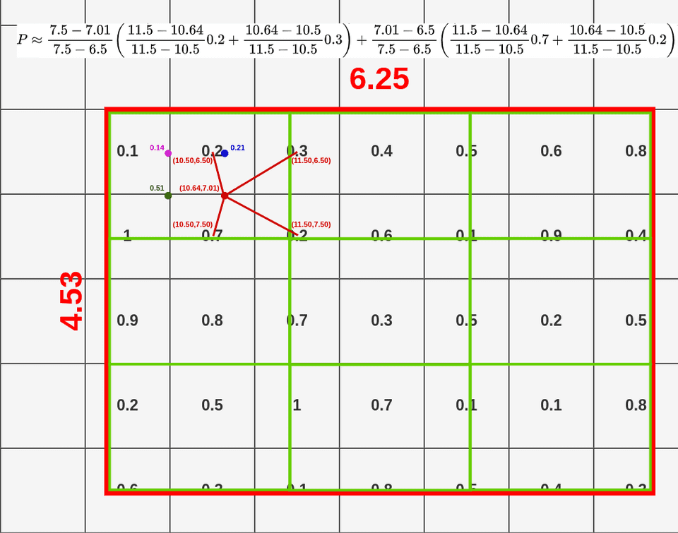

# R-CNN

R-CNN的全称是Region-CNN，是第一个成功将深度学习应用到目标检测上的算法。

- [R-CNN](#r-cnn)
  - [R-CNN](#r-cnn-1)
    - [R-CNN结构](#r-cnn结构)
    - [候选区域生成](#候选区域生成)
    - [特征提取](#特征提取)
    - [分类器分类](#分类器分类)
    - [回归器精细修正](#回归器精细修正)
    - [缺点](#缺点)
  - [Fast R-CNN](#fast-r-cnn)
    - [Fast R-CNN结构](#fast-r-cnn结构)
    - [输入](#输入)
    - [兴趣区域汇聚层（RoI pooling）](#兴趣区域汇聚层roi-pooling)
      - [输入](#输入-1)
      - [输出](#输出)
      - [步骤](#步骤)
    - [输出](#输出-1)
    - [损失函数](#损失函数)
  - [Faster R-CNN](#faster-r-cnn)
    - [Faster R-CNN结构](#faster-r-cnn结构)
    - [区域提议网络RPN（region proposal network）](#区域提议网络rpnregion-proposal-network)
    - [RPN损失函数](#rpn损失函数)
  - [Mask R-CNN](#mask-r-cnn)
    - [Mask R-CNN结构](#mask-r-cnn结构)
    - [RoIAlign](#roialign)
    - [Mask Branch(FCN)](#mask-branchfcn)
    - [损失函数](#损失函数-1)
  - [参考](#参考)

## R-CNN

R-CNN算法流程可分为4个步骤
- 一张图像生成1K-2K个候选区域(Selective Search)
- 对每个候选区域，使用深度网络提取特征
- 特征送入每一类SVM分类器，判别是否属于该类
- 使用回归器精细修正候选框位置

### R-CNN结构

### 候选区域生成

利用 Selective Search 算法通过图像分割的方法得到一些原始区域，然后利用一些合并策略将这些区域合并，得到一些层次化的区域结构，而这些结构就包含着可能需要的物体。

选择搜索算法SS的主要思想：图像中物体可能存在的区域应该是有某些相似性或者连续性区域的。首先，对输入图像进行分割算法产生许多小的子区域。其次，根据这些子区域之间相似性(相似性标准主要有颜色、纹理、大小等等)进行区域合并，不断的进行区域迭代合并。每次迭代过程中对这些合并的子区域做bounding boxes(外切矩形)，这些子区域外切矩形就是通常所说的候选框。

### 特征提取

将SS算法选出的2000个候选区域缩放到227x227，接着将其输入到事先训练好的AlexNet CNN网络中，获取4096维的特征得到2000x4096维矩阵。

### 分类器分类

将2000x4096的特征矩阵和20个SVM权值矩阵4096x20矩阵相乘，得到2000x20的矩阵代表每个建议框归属每个目标类别的概率。

分别对上面的每一类进行非极大值抑制NMS提出重叠建议框，得到该类中得分最高的一些建议框。

NMS算法首先寻找得分最高的目标，然后计算其它目标与该目标的IoU值，然后去除高于阈值的目标。

### 回归器精细修正

对NMS处理后剩余的建议框进行进一步筛选，即用20个回归器对20个分类的建议框进行回归，得到每个类别修正后得分最高的框。

### 缺点

- 测试速度慢
- 训练速度慢，所需空间大

    R-CNN需要同时对CNN网络，SVM分类器和回归器进行训练，所需开销较大，过程繁琐。

***

## Fast R-CNN

论文[Fast R-CNN](https://www.cv-foundation.org/openaccess/content_iccv_2015/papers/Girshick_Fast_R-CNN_ICCV_2015_paper.pdf)

R-CNN的主要性能瓶颈在于，对每个提议区域，卷积神经网络的前向传播是独立的，而没有共享计算。由于这些区域通常有重叠，独立的特征抽取会导致重复的计算。Fast R-CNN对R-CNN的主要改进之一，是仅在整张图象上执行卷积神经网络的前向传播。

Fast R-CNN 算法流程分三个步骤：
- 一张图像生成1k～2k个候选区域（elective Search）
- 将图像输入网络得到相应的特征图，将SS法生成的候选框投影到特征图上获得相应的特征矩阵
- 将每个特征矩阵通过ROI pooling层缩放为统一尺寸7x7大小的特征图，接着将特征图展平通过一系列全连接层获得预测结果。

### Fast R-CNN结构

### 输入

R-CNN依次将SS选择的提议区域的图片输入进行卷积。

而Fast R-CNN将整张图片送入网络进行卷积，然后在网络提取出的特征图中提取候选区域，去除了R-CNN中反复提取特征的部分。

### 兴趣区域汇聚层（RoI pooling）

RoI（Region of Interest）是从原始图像中提取的区域。而RoI pooling则是将这些区域在特征图内对应部分抠出来，并且得到统一大小的特征图的过程。

#### 输入

1. 从具有多个卷积核池化的深度网络中获得的固定大小的feature maps。
2. 一个表示所有 ROI 的 N*5 的矩阵，其中N表示ROI的数目。一列表示图像index，其余四列表示其余的左上角和右下角坐标。

#### 输出

输出是 batch 个 vector，其中 batch 的值等于 RoI 的个数，vector的大小为 channel ∗ w ∗ h。

ROI Pooling 的过程就是将一个个大小不同的矩形框，都映射成大小为 w ∗ h的矩形框。

#### 步骤

1. 根据输入image，将 ROI 映射到 feature map 对应位置；
2. 将映射后的区域划分为相同大小的 sections（sections数量与输出的维度相同）；
3. 对每个 sections 进行 max pooling 操作；

### 输出

分类器输出N+1个概率（N个类别+1个背景），回归器输出N+1个候选框回归参数$(d_x,d_y,d_w,d_h)$即(N+1)x4个。

实际预测的框的参数$(g_x,g_y,g_w,g_h)$和参数$(d_x,d_y,d_w,d_h)$的对应关系为：

$$g_x=p_wd_x+p_x \\ g_y=p_hd_y+p_y \\ g_w=p_we^{d_w} \\ g_h=p_he^{d_h}$$

### 损失函数

$$L(p,u,t^u,v)=L_{cls}(p,u)+\lambda[u\ge1]L_{loc}(t^u,v)$$

- p为分类器预测的softmax概率分布，即预测的目标分类
- u对应目标真实类别标签
- $t^u$为回归器遇到的回归参数$(t_x^u,t_y^u,t_h^u,t_w^u)$
- v为真实边界框参数$(v_x,v_y,v_w,v_h)$
- 分类损失$L_{cls}(p,u)=-logp_u$即交叉熵损失
- $\lambda$为平衡系数，用于平衡分类损失和回归损失
- $[u\ge1]$表示$u\ge1$时取1，其余取0
- 回归损失$L_{loc}(t^u,v)=\sum\limits_{i\in(x,y,w,h)}smooth_{L1}(t_i^u-v_i)$即平滑L1损失

***

## Faster R-CNN

论文[Faster R-CNN: Towards Real-Time Object Detection with Region Proposal Networks](https://arxiv.org/abs/1506.01497)

为了较精确地检测目标结果，Fast R-CNN模型通常需要在选择性搜索SS中生成大量的提议区域。Faster R-CNN提出将选择性搜索SS替换为区域提议网络RPN（region proposal network），从而减少提议区域的生成数量，并保证目标检测的精度。

Faster R-CNN 算法流程分三个步骤：

1. 将图像输入网络得到相应的特征图
2. 使用RPN结构生成候选框，将 RPN 生成的候选框投影到特征图上获得相应的特征矩阵。
3. 将每个特征矩阵通过 ROI pooling 层缩放为7x7大小的特征图，接着将特征图展平通过一系列全连接层获得预测结果。

### Faster R-CNN结构

### 区域提议网络RPN（region proposal network）

对特征图上使用滑动窗口，每滑动到一个位置时生成一个一维向量，然后分别使用两个全连接层得到2k个分类scores和4k个回归coordinates，即前景和背景的概率和4个预测框参数。

其中一维向量的长度是根据使用backbone的通道数来定的，比如VGG16为512个通道，而使用ZF网络则是256个通道。

每个滑动窗口的中心点对应原始图像中心点和生成的anchor boxes的中心点。

滑动窗口其实就是使用步长为1，padding也为1的3x3卷积。卷积后得到的和特征图尺寸深度都是一样的。

论文中根据经验得出锚框数k=9，即3种尺度x3种比例的锚框，滑动窗口在 ZF 网络中感受野为 171，而在 VGG16 中为 228。为什么还能预测 256 甚至 512 感受野呢？作者在论文中提出的观点是通过小感受野预测比他大的感受野是有可能的。

对于一个1000x600x3的图像，大约有60x40x9(约20k)个锚框，忽略跨越边界的锚框之后，剩下约6k个锚框。由于RPN生成的候选框之间存在大量的重叠，基于候选框的cls得分，采用非极大值抑制NMS，IoU设为0.7，这样最后剩下约2k个候选框。

注意：anchor box锚框和proposal box候选框不一样，锚框加上四个边界框回归参数才能成为候选框。

实际上生成的这么多候选框并不是每个都用来训练 RPN 网络。对于每张图片我们从上万个候选框当中采样 256 个候选框，这些候选框由正样本和负样本 1:1 组成。如果正样本不足 128，就用负样本进行填充。两种定义正样本的方式：（1）anchor 与 ground-truth 的 iou 超过 0.7，（2）某个 anchor 与 ground-truth 拥有最大的 iou。负样本是与所有的 ground-truth 的 iou 都小于 0.3 的。

### RPN损失函数

$$L(\{p_i\},\{t_i\})=\frac{1}{N_{cls}}\sum\limits_iL_{cls}(p_i,p_i^*)+\lambda\frac{1}{N_{reg}}\sum\limits_ip_i^*L_{reg}(t_i,t_i^*)$$

- $p_i$表示第i个anchor预测为真实标签的概率
- $p_i^*$为正样本时为1，为负样本时为0
- $t_i$表示预测第i个anchor的边界框回归参数
- $t_i^*$表示第i个anchor对应的 Ground-True Box
- $N_{cls}$表示一个mini-batch中所有样本数量256
- $N_{reg}$表示anchor位置个数（不是anchor个数）约2400
- $\lambda$为平衡系数，用于平衡分类损失和回归损失
- 分类损失$L_{cls}=-logp_i$即交叉熵损失
- 回归损失$L_{loc}(t_i,t_i^*)=\sum\limits_{i\in(x,y,w,h)}smooth_{L1}(t_i-t_i^*)$即平滑L1损失

***

## Mask R-CNN

论文[Mask R-CNN](https://arxiv.org/abs/1703.06870)

如果在训练集中还标注了每个目标在图像上的像素级位置，那么Mask R-CNN (He et al., 2017)能够有效地利用这些详尽的标注信息进一步提升目标检测的精度。

### Mask R-CNN结构

Mask R-CNN是基于Faster R-CNN修改而来的。

具体来说，Mask R-CNN将兴趣区域汇聚层替换为了 兴趣区域对齐层(RoIAlign)，使用双线性插值（bilinear interpolation）来保留特征图上的空间信息，从而更适于像素级预测。 兴趣区域对齐层的输出包含了所有与兴趣区域的形状相同的特征图。它们不仅被用于预测每个兴趣区域的类别和边界框，还通过额外的全卷积网络Mask分支预测目标的像素级位置。

### RoIAlign

RoI 池化 有一个主要的问题。它在处理过程中丢失了大量的数据。

量化数据丢失(深蓝色和浅蓝色)，数据获得(绿色)

每次进行 RoI 池化操作的时候，就会丢失关于该对象的部分信息。这降低了整个模型的精确度，很多真正聪明的人都考虑过这个问题。

我们可以将原始RoI分成9个等大小的小格子，并在每个盒子内应用双线性插值。

让我们尝试在RoI中确定进行池化的每个框。每个框的大小由映射的RoI的大小和池化层的大小决定。我们使用了一个 3x3 的池化层，所以我们必须将映射的RoI (6.25x4.53)除以3。这样我们就得到了一个高为 1.51 ，宽为 2.08 的方框(我在这里约简以使它更容易)。现在我们可以把我们的方框放入映射的RoI中:

如果查看第一个框(左上角)，可以注意到它覆盖了6个不同的网格单元格。为了提取池化层的值，我们必须从池化层中采样一些数据。为了对数据进行采样，我们必须在盒子里创建 四个采样点。

采样点个数由参数决定，作者在论文中提到，最终的采样结果与采样点位置和个数并不敏感。

采样点的位置为等分点的位置。

现在，当我们有了所有的点我们可以应用双线性插值对这个方框进行数据采样。图像处理中常用双线性插值对颜色进行采样，其方程如下:

$$P\approx \frac{y_2-y}{y_2-y_1}(\frac{x_2-x}{x_2-x_1}Q_{11}+\frac{x-x_1}{x_2-x_1}Q_{21})+\frac{y-y_1}{y_2-y_1}(\frac{x_2-x}{x_2-x_1}Q_{12}+\frac{x-x_1}{x_2-x_1}Q_{22})$$

然后将采样点和最近的四个特征图的中心点做双线性差值，得到采样点的值。

取所有采样点的平均值作为RoIAlign的结果

### Mask Branch(FCN)

对于带有FPN和不带有FPN的Mask R-CNN，他们的Mask分支不太一样。下图左边是不带FPN结构的Mask分支，右侧是带有FPN结构的Mask分支（灰色部分为原Faster R-CNN预测box, class信息的分支，白色部分为Mask分支）。

在使用FCN的网络中，Mask分支和Fast R-CNN不共用RoIAlign，它们的大小是不同的，更大的输出有助于mask的生成。

### 损失函数

Mask R-CNN的损失就是在Faster R-CNN的基础上加上Mask分支的损失

$$Loss=L_{rpn}+L_{fast\_rcnn}+L_{mask}$$

在讲Mask分支损失计算之前，我们要弄清楚logits（网络预测的输出）是什么，targets（对应的GT）是什么。前面有提到训练时输入Mask分支的目标是RPN提供的Proposals，所以网络预测的logits是针对每个Proposal对应每个类别的Mask信息（注意预测的Mask大小都是28x28）。并且这里输入的Proposals都是正样本（在Fast R-CNN阶段采样得到的），对应的GT信息（box、cls）也是知道的。

如下图所示，假设通过RPN得到了一个Proposal（图中黑色的矩形框），通过RoIAlign后得到对应的特征信息（shape为14x14xC），接着通过Mask Branch预测每个类别的Mask信息得到图中的logits（logits通过sigmoid激活函数后，所有值都被映射到0至1之间）。通过Fast R-CNN分支正负样本匹配过程我们能够知道该Proposal的GT类别为猫（cat），所以将logits中对应类别猫的预测mask（shape为28x28）提取出来。然后根据Proposal在原图对应的GT上裁剪并缩放到28x28大小，得到图中的GT mask（对应目标区域为1，背景区域为0）。最后计算logits中预测类别为猫的mask与GT mask的BCELoss（BinaryCrossEntropyLoss）即可。

## 参考

[R-CNN系列巨详细解读](https://zhuanlan.zhihu.com/p/658024219)

[Faster RCNN理论合集](https://www.bilibili.com/video/BV1af4y1m7iL/)

[动手学深度学习](https://zh-v2.d2l.ai/chapter_computer-vision/rcnn.html#id5)

[Understanding Region of Interest — (RoI Pooling)](https://towardsdatascience.com/understanding-region-of-interest-part-1-roi-pooling-e4f5dd65bb44)

[一文读懂 RoIPooling、RoIAlign 和 RoIWarp](https://cloud.tencent.com/developer/article/1689064)

[深度学习之 ROI Pooling](https://blog.csdn.net/fenglepeng/article/details/117885129)

[Mask R-CNN网络详解](https://www.bilibili.com/video/BV1ZY411774T/)