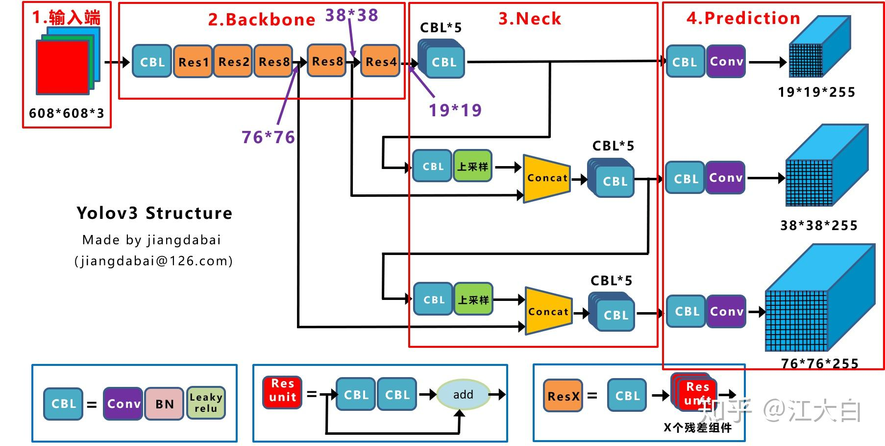
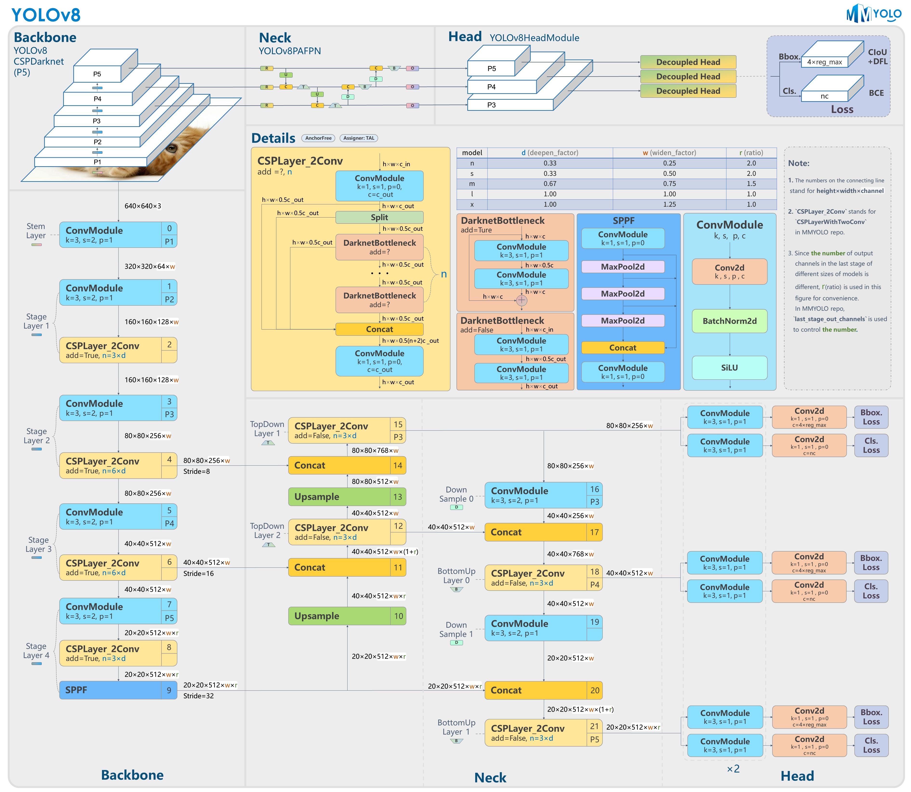

# YOLO

- [YOLO](#yolo)
  - [总体介绍](#总体介绍)
  - [YOLOv1](#yolov1)
    - [处理流程](#处理流程)
    - [模型结构](#模型结构)
    - [损失函数](#损失函数)
    - [优缺点](#优缺点)
  - [YOLOv2](#yolov2)
    - [改进内容](#改进内容)
    - [模型结构](#模型结构-1)
  - [YOLOv3](#yolov3)
    - [模型结构](#模型结构-2)
    - [改进内容](#改进内容-1)
    - [损失函数](#损失函数-1)
  - [YOLOv4](#yolov4)
    - [模型结构](#模型结构-3)
    - [改进部分](#改进部分)
      - [Bag of freebies](#bag-of-freebies)
      - [Bag of specials](#bag-of-specials)
  - [YOLOv5](#yolov5)
    - [网络结构](#网络结构)
    - [改进内容](#改进内容-2)
  - [YOLOv6](#yolov6)
    - [网络结构](#网络结构-1)
    - [简述改进部分](#简述改进部分)
  - [YOLOv7](#yolov7)
    - [模型结构](#模型结构-4)
    - [改进部分](#改进部分-1)
  - [YOLOv8](#yolov8)
    - [模型结构](#模型结构-5)
    - [改进内容](#改进内容-3)
    - [C2f](#c2f)
    - [损失函数](#损失函数-2)
  - [YOLOv9](#yolov9)
    - [网络结构](#网络结构-2)
    - [改进内容](#改进内容-4)
  - [YOLOv10](#yolov10)
    - [模型结构](#模型结构-6)
    - [改进内容](#改进内容-5)
      - [双标签分配](#双标签分配)
      - [效率驱动的模型设计](#效率驱动的模型设计)
      - [基于精度导向的模型设计](#基于精度导向的模型设计)
    - [C2fCIB](#c2fcib)
    - [PSA](#psa)
    - [SCDown](#scdown)
  - [参考和推荐](#参考和推荐)


You Only Look Once

我只看一次就可以识别出来了，要的就是又快又准。

YOLO(You Only Look Once)是一种流行的物体检测和图像分割模型，由华盛顿大学的约瑟夫-雷德蒙（Joseph Redmon）和阿里-法哈迪（Ali Farhadi）开发。

- YOLO 于 2015 年推出，因其高速度和高精确度而迅速受到欢迎。
- 2016 年发布的YOLOv2 通过纳入批量归一化、锚框和维度集群改进了原始模型。
- 2018 年推出的YOLOv3 使用更高效的骨干网络、多锚和空间金字塔池进一步增强了模型的性能。
- YOLOv4于 2020 年发布，引入了 Mosaic 数据增强、新的无锚检测头和新的损失函数等创新技术。
- YOLOv5进一步提高了模型的性能，并增加了超参数优化、集成实验跟踪和自动导出为常用导出格式等新功能。
- YOLOv6于 2022 年由美团开源，目前已用于该公司的许多自主配送机器人。
- YOLOv7增加了额外的任务，如 COCO 关键点数据集的姿势估计。
- YOLOv8是YOLO 的最新版本，由Ultralytics 提供。YOLOv8 YOLOv8 支持全方位的视觉 AI 任务，包括检测、分割、姿态估计、跟踪和分类。这种多功能性使用户能够在各种应用和领域中利用YOLOv8 的功能。
- YOLOv9 引入了可编程梯度信息 （PGI） 和广义高效层聚合网络 （GELAN） 等创新方法。
- YOLOv10是由清华大学的研究人员使用该软件包创建的。 UltralyticsPython 软件包创建的。该版本通过引入端到端头（End-to-End head），消除了非最大抑制（NMS）要求，实现了实时目标检测的进步。

## 总体介绍

- YOLO系列的核心思想就是把目标检测转变为一个回归问题，利用整张图片作为网络的输入，通过神经网络，得到边界框的位置及其所属的类别。
- 经典 one-stage 方法

***

## YOLOv1

论文[You Only Look Once: Unified, Real-Time Object Detection](https://arxiv.org/abs/1506.02640)

### 处理流程

1. 输入图片resize为448x448x3
2. 将图片分割成SxS的网格，一般为7x7网格
3. 每个网格设置两个候选框，预设候选框大小(h,w)按照经验值设置，框的位置(x,y)默认为中心点
4. 得到真实值和候选框的IoU，并且选择更合适的框
5. 对候选框进行微调，即预测候选框的(x,y,h,w)和置信度c，以及物体的分类


### 模型结构


- 主干网络（GoogleLeNet）：输入图像resize到448x448x3，经过多次卷积池化得到7x7x1024的特征图。
- 检测头：将特征图全连接展开，第一个全连接得到4096个特征，第二个全连接之后得到7x7x30的输出。其中7x7为图片对应网格数，30为每个网格的特征值，即10个为两个候选框的(x,y,w,h,c)，20为20个分类即每个类别的预测概率

### 损失函数


### 优缺点

- 优点
  - 快速，简单
- 缺点
  - 每个cell只预测一个类别，重叠无法解决
  - 小物体检测效果一般，长宽比可选但单一

***

## YOLOv2

论文[YOLO9000: Better, Faster, Stronger](https://arxiv.org/abs/1612.08242)

### 改进内容

- Batch Normalization 
 
    归一化有助于解决梯度消失和梯度爆炸的问题，降低一些超参数的敏感性（比如学习率、网络参数的大小范围、激活函数的选择），并且起到了一定的正则化效果，从而能够获得更好的收敛速度和收敛效果。

- 高分辨率分类器

    和YOLOv1一样，他们在ImageNet以224x224的分辨率对模型进行了预训练。然而，这一次，他们在分辨率为448x448的ImageNet上对模型进行了10次微调，提高了网络在高分辨率输入下的性能。

- 全卷积层

    去除了全连接层，采用了全卷积结构。

- 锚框 Anchor Boxes

    受FasterRCNN启发YOLOv2采用锚框，即在每个网格中预先定义一组不同大小的边框，用来预测对象是否在框中和微调边框位置。由于YOLOv2的锚框数量多所以最终去除全连接层，直接使用锚框进行预测。

- 维度聚类 Dimension Clusters

    YOLOv2对训练集中标注的边框进行K-means聚类分析，以寻找尽可能匹配样本的边框尺寸。

    如果我们用标准的欧式距离的k-means，尺寸大的框比小框产生更多的错误。因为我们的目的是提高IOU分数，这依赖于Box的大小，所以距离度量的使用：

    $$d(box,centroid)=1-IoU(box,centroid)$$

    其中，centroid是聚类时被选作中心的边框，box就是其它边框，d就是两者间的“距离”，IOU越大，“距离”越近。通过实验结果的分析，选择k-means的k=5。

- 直接预测位置

    Yolov2网络在每一个网格单元中预测出5个边框，每个边框有五个值$t_x,t_y,t_w,t_h,t_o$如果单元格与图像左上角的偏移为$(c_x, c_y)$，并且边界框先验的宽度和高度为 $p_w,p_h$，则预测的结果：

    $$b_x=\sigma(t_x)+c_x \\ b_y=\sigma(t_y)+c_y \\ b_w=p_we^{t_w} \\ b_h=p_he^{t_h} \\ P_r(object)*IoU(b,object)=\sigma(t_o)$$

    

- 细粒度特征 Fine-Grained Features

    最后一层感受野太大了，小目标可能丢失了，需融合之前的特征。YOLOv2通过passthrough的方法获得细粒度特征。具体来说，就是在最后一个pooling之前，将其1拆4，直接传递（passthrough）到pooling后（并且又经过一组卷积）的特征图，两者叠加到一起作为输出的特征图。

    

- 多尺度训练

    由于YOLOv2不使用全连接层，输入可以是不同的尺寸。为了使YOLOv2对不同的输入尺寸具有鲁棒性，作者随机训练模型，每10批改变尺寸（从320x320到608x608）。

### 模型结构


Darknet-19
1. 使用了很多3x3卷积核；并且每一次池化后，下一层的卷积核的通道数=池化输出的通道 x 2
2. 在每一层卷积后，都增加了BN层进行预处理
3. 采用了降维的思想，把1x1的卷积置于3x3之间，用来压缩特征
4. 在网络最后的输出上增加了一个global average pooling层

***

## YOLOv3

论文[YOLOv3: An Incremental Improvement](https://pjreddie.com/media/files/papers/YOLOv3.pdf)

### 模型结构

Darknet-53




1. CBL: Conv+BN+LeakyReLU。
2. Res unit: 借鉴Resnet网络中的残差结构，让网络可以构建的更深。
3. ResX: 由一个CBL和X个残差组件构成，是Yolov3中的大组件。每个Res模块前面的CBL都起到下采样的作用。
4. Concat: 张量拼接，会扩充两个张量的维度。Concat和cfg文件中的route功能一样。
5. add:张量相加，张量直接相加，不会扩充维度。add和cfg文件中的shortcut功能一样。

Darknet53的主要改进：

- 没有采用最大池化层，转而采用步长为2的卷积层进行下采样
- 去掉了全连接层
- 为了防止过拟合，在每个卷积层之后加入了一个BN层和一个Leaky ReLU
- 引入了残差网络的思想，目的是为了让网络可以提取到更深层的特征，同时避免出现梯度消失或爆炸
- 将网络的中间层和后面某一层的上采样进行张量拼接，达到多尺度特征融合的目的
- 网格大小有三种

### 改进内容

- 多尺度预测

    为了能够预测多尺度的目标，YOLOv3 选择了三种不同shape的Anchors，同时每种Anchors具有三种不同的尺度，一共9种不同大小的Anchors。

    

- 特征金字塔网络(feature parymid network,FPN)

    

    通过特征金字塔进行分层，使不同大小的特征图可以更好地预测不同大小的框。最小的特征图的感受野最大，可以预测大目标，反之则是感受野小细节多，可以预测小目标。

    通过上采样的方法，将不同大小特征图进行融合，从而使小特征图中的全局信息可以更好地帮助大的特征图进行预测。

- 残差连接

    

    残差连接的核心思想是引入一个"shortcut"或"skip connection"，允许输入信号直接绕过一些层，并与这些层的输出相加。这样，网络不再需要学习将输入映射到输出的完整函数，而是学习一个残差函数，即输入与期望输出之间的差异。

- 先验框设计

    通过聚类得到9种锚框。

    |特征图|13x13|26x26|52x52|
    |---|---|---|---|
    |感受野|大|中|小|
    |先验框|(116x90)(156x198)(373x326)|(30x61)(62x45)(59x119)|(10x13)(16x30)(33x23)|
    
    

- 多标签分类

    YOLOv3在类别预测方面将YOLOv2的单标签分类改进为多标签分类，在网络结构中将YOLOv2中用于分类的softmax层修改为逻辑分类器。即是用logistic激活函数。

### 损失函数

$$\begin{align}
Loss &=\lambda_{coord}\sum_{i=0}^{S^2}\sum_{j=0}^{B}I_{ij}^{obj}[(x_i^j-\hat{x}_i^j)^2+(y_i^j-\hat{y}_i^j)^2] \\
&+\lambda_{coord}\sum_{i=0}^{S^2}\sum_{j=0}^{B}I_{ij}^{obj}[(x_i^j-\hat{x}_i^j)^2+(y_i^j-\hat{y}_i^j)^2] \\
&-\sum_{i=0}^{S^2}\sum_{j=0}^{B}I_{ij}^{obj}[\hat{C}_i^jlog(C_j^j)+(1-\hat{C}_i^j)log(1-C_j^j)] \\
&-\lambda_{noobj}\sum_{i=0}^{S^2}\sum_{j=0}^{B}I_{ij}^{noobj}[\hat{C}_i^jlog(C_j^j)+(1-\hat{C}_i^j)log(1-C_j^j)] \\
&-\sum_{i=0}^{S^2}I_{ij}^{noobj}\sum_{c\in classes}[\hat{P}_i^j(C)log(P_i^j(C))+(1-\hat{P}_i^j(C))log(P_i^j(C))]\end{align}$$

相比YOLOv1中的损失函数，置信度损失和类别预测的改为了交叉熵损失。

***

## YOLOv4

论文[YOLOv4: Optimal Speed and Accuracy of Object Detection](https://arxiv.org/abs/2004.10934)

### 模型结构


- CBM：Yolov4网络结构中的最小组件，由Conv+Bn+Mish激活函数三者组成。
- CBL：由Conv+Bn+Leaky_relu激活函数三者组成。
- Res unit：借鉴Resnet网络中的残差结构，让网络可以构建的更深。
- CSPX：借鉴CSPNet网络结构，由卷积层和X个Res unint模块Concate组成。
- SPP：采用1×1，5×5，9×9，13×13的最大池化的方式，进行多尺度融合。

YOLOv4=CSODarknet53(backbone)+SPP模块(neck)+PANet(neck)+YOLOv3head(head)


### 改进部分

作者分为了BOF和BOS两部分。

Bag of freebies: 只增加训练成本，但是能显著提高精度，并不影响推理速度

Bag of speacials: 增加稍许推断代价，单可以提高模型精度的方法

#### Bag of freebies

- mosaic数据增强

    将四张不同的训练图像随机拼接在一起，形成一张马赛克图像进行训练。这种方式可以帮助模型学习并适应不同的场景、目标形状和尺度变化。

    

- 数据增强
  - Random Erase: 用随机值或训练集的平均像素值替换图像区域
  - Hide and Seek: 根据概率设置随机隐藏一些patch
  - 等等

    

- 自对抗训练(Self-Adversarial Training,SAT)

    SAT是一种自对抗训练数据增强方法，这一种新的对抗性训练方式。在第一阶段，神经网络改变原始图像而不改变网络权值。以这种方式，神经网络对自身进行对抗性攻击，改变原始图像，以制造图像上没有所需对象的欺骗。在第二阶段，用正常的方法训练神经网络去检测目标。

- DropBlock

    之前dropout随机选择点，现在随机选择一个区域

    

- Label Smoothing

    将类别标签进行平衡如(cat,dog)=(1,0)->[1,0]x(1-0.1)+0.1/2=[0.05,0.95]

    使用之后可以使簇内更紧密，簇间更分离。

- 损失函数

    

    

    

    

#### Bag of specials

- DIoU-NMS和Soft-NMS

    之前采用NMS，选择采用DIoU-NMS，考虑Box中心点距离。

    Soft-NMS则是更柔和的NMS，将之前会直接删除的框，变为修改分数即$s_i<-s_if(iou(M,b_i))$

    $$s_i=\begin{cases}
        s_i,IoU-R_{DIoU}(M,B_i)\lt\varepsilon \\
        0,IoU-R_{DIoU}(M,B_i)\ge\varepsilon
    \end{cases} R_{DIoU}=\frac{\rho^2(b,b^{gt})}{c^2}$$

    M表示高置信度候选框，$B_i$是遍历各个框跟置信度高的框的重合情况

- SPPNet(Spatial Pyramid Pooling)
  - 增大感受野
  - 使用最大池化满足最终输入特征一致

- CSPNet(Cross Stage Partial Network)

    CSPNet的主要目的是能够实现更丰富的梯度组合，同时减少计算量。

    每个block按照特征图的channel分为两部分，一部分走正常网络，另一份直接concat到这个block的输出

    

- SAM(Spatial Attention Module)

    作者在原SAM(Spatial Attention Module)方法上进行了修改，将SAM从空间注意修改为点注意。通过引入SAM模块，YOLOv4能够自适应地调整特征图的通道注意力权重。

    

- PAN(Path Aggregation Network)

    YOLOv4引入了PAN（Path Aggregation Network）模块，用于在不同尺度的特征图之间进行信息传递和融合，以获取更好的多尺度特征表示。

    

    作者对原PAN(Path Aggregation Network)方法进行了修改, 使用张量连接(concat)代替了原来的快捷连接(shortcut connection)。

    

- Mish激活函数

    $$f(x)=x \cdot tanh(ln(1+e^x))$$

***

## YOLOv5

没有论文只有代码[https://github.com/ultralytics/yolov5]

### 网络结构


- Focus：基本上就是YOLOv2的passthrough。
- CBL：由Conv+Bn+Leaky ReLU三者3组成。
- CSP1_X：借鉴CSPNet网络结构，由三个卷积层和X个Res unit模块Concat组成。
- CSP2_X：不再用Res unit模块，而是改为CBL。
- SPP：采用1x1，5x5，9x9，13x13的最大池化方式，进行多尺度融合。

- 输入端：Mosaic数据增强、自适应锚框计算、自适应图片缩放
- Backbone：Focus结构，CSP结构
- Neck：FPN+PAN结构
- Head：CIOU_Loss

### 改进内容

- 自适应锚框计算

    在Yolo算法中，针对不同的数据集，都会有初始设定长宽的锚框。

    在网络训练中，网络在初始锚框的基础上输出预测框，进而和真实框groundtruth进行比对，计算两者差距，再反向更新，迭代网络参数。

    在Yolov3、Yolov4中，训练不同的数据集时，计算初始锚框的值是通过单独的程序运行的。

    但Yolov5中将此功能嵌入到代码中，每次训练时，自适应的计算不同训练集中的最佳锚框值。

- 自适应图片缩放

    在常用的目标检测算法中，不同的图片长宽都不相同，因此常用的方式是将原始图片统一缩放到一个标准尺寸，再送入检测网络中。

    因此在Yolov5的代码中datasets.py的letterbox函数中进行了修改，对原始图像自适应的添加最少的黑边。

- Focus结构

    Focus结构是YOLOv5中的一个重要组件，用于提取高分辨率特征。它采用的是一种轻量级的卷积操作，帮助模型在保持较高感受野的同时减少计算负担。Focus结构通过将输入特征图进行通道划分和空间划分，将原始特征图转换为更小尺寸的特征图，并保留了原始特征图中的重要信息。这样做有助于提高模型的感知能力和对小尺寸目标的检测准确性。

    

- CSP结构

    YOLOv4网络结构中，借鉴了CSPNet的设计思路，仅仅在主干网络中设计了CSP结构。而YOLOv5中设计了两种CSP结构，以YOLOv5s网络为例，CSP1_X结构应用于Backbone主干网络中，另一种CSP2_X结构则应用于Neck网络中。

***

## YOLOv6

论文[YOLOv6: A Single-Stage Object Detection Framework for Industrial Applications](https://arxiv.org/pdf/2209.02976)
代码[https://github.com/meituan/YOLOv6/]

### 网络结构


- 统一设计了更高效的 Backbone 和 Neck ：受到硬件感知神经网络设计思想的启发，基于 RepVGG style设计了可重参数化、更高效的骨干网络 EfficientRep Backbone 和 Rep-PAN Neck。
- 优化设计了更简洁有效的 Efficient Decoupled Head，在维持精度的同时，进一步降低了一般解耦头带来的额外延时开销。
- 在训练策略上，我们采用Anchor-free 无锚范式，同时辅以 SimOTA标签分配策略以及 SIoU边界框回归损失来进一步提高检测精度。

### 简述改进部分

1. 输入端

    无锚框

2. 主干

    YOLOv6的Backbone的实现的基本模块为RVB1_X结构，其全程为RepVGGBlock_X，表示由多个RepVGGBlock组成。

    RepVGGBlock是RepVGG网络的重复模块，由多个RepVGGConv模块组成。每个RepVGGBlock由两个RepVGGConv模块组成，第一个RepVGGConv是一个3x3卷积操作，而第二个RepVGGConv是一个1x1卷积操作。

    这两个卷积模块之间使用了批归一BatchNorm）和ReLU激活函数。RepVGGConv模块是RepVGG网络中的基本卷积模块，由一个卷积层、批归一化和ReLU激活函数组成。这样的设计使得RepVGGBlock具有较强的表达能力，并且可以适应不同的特征提取需求。

    epVGGBlock在RepVGG网络中被重复堆叠多次，形成了深层的网络结构。通过堆叠多个RepVGGBlock，可以提高网络的表示能力和复杂度，从而实现更准确的特征提取和目标识别。

3. 颈部

    PANet结构类似更换为RepVGGBlock结构

4. 输出端

    YOLOv6对检测头进行了解耦，分开了边框与类别的分类过程。

***

## YOLOv7

论文[YOLOv7: Trainable bag-of-freebies sets new state-of-the-art for real-time object detectors](https://arxiv.org/pdf/2207.02696)

代码[https://arxiv.org/pdf/2207.02696]

### 模型结构


首先对输入的图片 resize 为 640x640 大小，输入到 backbone 网络中，然后经 head 层网络输出三层不同 size 大小的 **feature map**，经过 Rep 和 conv输出预测结果，这里以 coco 为例子，输出为 80 个类别，然后每个输出(x ,y, w, h, o) 即坐标位置和前后背景，3 是指的 anchor 数量，因此每一层的输出为 (80+5)x3 = 255再乘上 feature map 的大小就是最终的输出了。

### 改进部分

- CBS结构：特征提取和通道转换。
- ELAN：通过不同的分支将特征图拼接起来，进而促进更深层网络的有效学习和收敛。
- MP-1：将经过不同下采样方式所得到的特征图进行融合，在不增加计算量的同时保留更多的特征信息。
- SPPCSPC模块用于提高特征提取的效率和准确率
- ELANW模块相比于ELAN模块增加了两个拼接操作

***

## YOLOv8

代码[https://github.com/ultralytics/ultralytics]

### 模型结构



### 改进内容

- Backbone：使用的依旧是CSP的思想，将YOLOv5中的C3模块被替换成了C2f模块，实现了进一步的轻量化，同时YOLOv8依旧使用了YOLOv5等架构中使用的SPPF模块；
- PAN-FPN：YOLOv8依旧使用了PAN的思想，不同的是YOLOv8将YOLOv5中PAN-FPN上采样阶段中的卷积结构删除了，同时也将C3模块替换为了C2f模块；
- Decoupled-Head：这一点源自YOLOX；分类和回归两个任务的head不再共享参数，YoloV8也借鉴了这样的head设计。
- Anchor-Free：YOLOv8抛弃了以往的Anchor-Base，使用了Anchor-Free的思想；
- 损失函数：YOLOv8使用VFL Loss作为分类损失，使用DFL Loss+CIOU Loss作为回归损失；
- 样本匹配：YOLOv8抛弃了以往的IOU匹配或者单边比例的分配方式，而是使用了Task-Aligned Assigner匹配方式。

### C2f

先经过一个Conv，然后使用chunk函数将out平均拆分成两个向量，然后保存到list中，将后半部分输入到Bottleneck Block里面，Bottleneck Block里面有n个Bottleneck，将每个Bottleneck的输出都追加list中，有n个，所以拼接之后的out等于0.5✖(n+2)。然后经过一个Conv输出，所以输出为h×w×c_out。


C2f模块参考了C3模块以及ELAN的思想进行的设计，让YOLOv8可以在保证轻量化的同时获得更加丰富的梯度流信息。

### 损失函数

对于YOLOv8，其分类损失为VFL Loss，其回归损失为CIOU Loss+DFL的形式，这里Reg_max默认为16。

VFL主要改进是提出了非对称的加权操作，FL和QFL都是对称的。而非对称加权的思想来源于论文PISA，该论文指出首先正负样本有不平衡问题，即使在正样本中也存在不等权问题，因为mAP的计算是主正样本。

$$VFL(p,q)=\begin{cases}
    -q(qlog(p)+(1-q)log(1-p)) &, q>0 \\
    -\alpha p^\gamma log(1-p) &, q=0
\end{cases}$$

q是label，正样本时候q为bbox和gt的IoU，负样本时候q=0，当为正样本时候其实没有采用FL，而是普通的BCE，只不过多了一个自适应IoU加权，用于突出主样本。而为负样本时候就是标准的FL了。可以明显发现VFL比QFL更加简单，主要特点是正负样本非对称加权、突出正样本为主样本。

针对这里的DFL（Distribution Focal Loss），其主要是将框的位置建模成一个 general distribution，让网络快速的聚焦于和目标位置距离近的位置的分布。

DFL 能够让网络更快地聚焦于目标 y 附近的值，增大它们的概率；

DFL的含义是以交叉熵的形式去优化与标签y最接近的一左一右2个位置的概率，从而让网络更快的聚焦到目标位置的邻近区域的分布；也就是说学出来的分布理论上是在真实浮点坐标的附近，并且以线性插值的模式得到距离左右整数坐标的权重。

***

## YOLOv9

论文[YOLOv9: Learning What You Want to Learn Using Programmable Gradient Information](https://arxiv.org/abs/2402.13616)

代码[https://github.com/WongKinYiu/yolov9]

### 网络结构


### 改进内容

- 可编程梯度信息（PGI）

    论文提出了一种新的辅助监督框架，称为可编程梯度信息（PGI），如图（d）所示。 PGI主要包括三个组成部分：主分支、辅助可逆分支、多级辅助信息。

    

    从图(d)中我们可以看出，PGI的推理过程仅使用主分支，因此不需要任何额外的推理成本。至于其他两个组件，它们仅用于训练阶段而不在推理阶段，用于解决或减缓深度学习方法中的几个重要问题：

  - 辅助可逆分支：是为了处理神经网络加深带来的问题而设计的。网络加深会造成信息瓶颈，导致损失函数无法生成可靠的梯度。
  - 对于多级辅助信息：旨在处理深度监督带来的误差累积问题，特别是针对多个预测分支的架构和轻量级模型。

- GELAN

    通过结合采用梯度路径规划设计的两种神经网络架构CSPNet 和ELAN ，论文设计了兼顾轻量级、推理速度和准确性的广义高效层聚合网络（GELAN）。其整体架构如图 4 所示。论文将最初仅使用卷积层堆叠的 ELAN 的功能推广到可以使用任何计算块的新架构。

    

***

## YOLOv10

论文[YOLOv10: Real-Time End-to-End Object Detection](https://arxiv.org/abs/2405.14458)

代码[https://github.com/THU-MIG/yolov10]

### 模型结构


和YOLOv8相比主要多了C2fCIB模块和PSA模块，用来去除对NMS的依赖。

### 改进内容

#### 双标签分配

与一对一多分配不同，一对一匹配只为每个地面真相分配一个预测，避免了NMS后处理。然而，这导致了较弱的监督，导致次优的准确性和收敛速度。幸运的是，这种缺陷可以通过一对一多分配来弥补。为此，作者为YOLO引入了双重标签分配，以结合两种策略的优点。


具体来说，如图2.(a)所示，作者在YOLO中增加了一个一对一的 Head 。它与原始一对一多分支保持相同的结构和采用相同的优化目标，但利用一对一匹配来获得标签分配。在训练过程中，两个 Head 与模型联合优化，使得主干和 Neck 能够享受到一对一多分配提供的丰富监督。

在推理过程中，作者丢弃一对一多 Head ，并利用一对一 Head 进行预测。这使得YOLO能够端到端部署，而不会产生任何额外的推理成本。此外，在一对一匹配中，作者采用顶部选择，其性能与匈牙利匹配[4]相同，但额外的训练时间更少。

#### 效率驱动的模型设计

- 轻量级的分类头:

    在YOLOs中，分类头和回归头通常共享相同的架构。然而，它们在计算开销上表现出显著的差异。例如，在YOLOv8-S中，分类头的FLOPs（5.95G）和参数数（1.51M）分别是回归头（2.34G/0.64M）的2.5倍和2.4倍。然而，在分析了分类错误和回归错误的影响后（见表6），我们发现回归头对YOLOs的性能更为重要。因此，我们可以在不过分损害性能的情况下减少分类头的开销。因此，我们简单地采用了一种轻量级的架构用于分类头，它由两个深度可分离卷积[24, 8]组成，卷积核大小为3×3，后面跟着一个1×1的卷积。

- 空间通道解耦下采样:

    YOLOs通常利用常规的3×3标准卷积，步长为2，同时实现空间下采样（从H×W到H/2×W/2）和通道变换（从C到2C）。这引入了不可忽视的计算成本O(9HWC^2)和参数数量O(18C^2)。相反，我们提议将空间缩减和通道增加操作解耦，以实现更高效的下采样。具体来说，我们首先利用点对点卷积来调整通道维度，然后利用深度可分离卷积进行空间下采样。这将计算成本降低到O(2HWC^2 + 9HWC)，并将参数数量减少到O(2C^2 + 18C)。同时，它最大限度地保留了下采样过程中的信息，从而在减少延迟的同时保持了有竞争力的性能。

- 基于rank引导的模块设计：

    YOLOs通常在所有阶段使用相同的基本构建块，例如YOLOv8中的瓶颈块。为了彻底检查YOLOs的这种同质设计，我们利用内在秩来分析每个阶段的冗余。具体来说，我们计算每个阶段中最后一个基本块的最后一个卷积的数值秩，这计算了大于阈值的奇异值的数量。图3.(a)展示了YOLOv8的结果，表明深层阶段和大型模型更容易表现出更多的冗余。这一观察表明，简单地为所有阶段应用相同的块设计对于最佳的容量-效率权衡是次优的。为了解决这个问题，我们提出了一种基于秩的块设计方案，旨在通过紧凑的架构设计降低被证明是冗余的阶段复杂度。我们首先提出了一个紧凑的倒置块（CIB）结构，它采用廉价的深度可分离卷积进行空间混合，以及成本效益高的点对点卷积进行通道混合，如图3.(b)所示。它可以作为高效的基本构建块，例如嵌入在ELAN结构中（图3.(b)）。然后，我们提倡一种基于秩的块分配策略，以实现最佳效率，同时保持有竞争力的容量。具体来说，给定一个模型，我们根据其内在秩按升序对所有阶段进行排序。我们进一步检查用CIB替换领先阶段的基本块的性能变化。如果与给定模型相比没有性能下降，我们就继续替换下一个阶段，否则就停止该过程。因此，我们可以在不同阶段和模型规模上实现自适应的紧凑块设计，实现更高的效率而不损害性能。


#### 基于精度导向的模型设计

- 大核卷积：

    使用大核深度可分离卷积是一种有效的方式来扩大感受野并增强模型的能力。然而，简单地在所有阶段利用它们可能会在用于检测小物体的浅层特征中引入污染，同时也会在高分辨率阶段引入显著的I/O开销和延迟。因此，我们提议在深层阶段的CIB中利用大核深度可分离卷积。具体来说，我们将CIB中第二个3×3深度可分离卷积的核大小增加到7×7，遵循[37]。此外，我们采用结构重参数化技术来引入另一个3×3深度可分离卷积分支，以缓解优化问题而不增加推理开销。此外，随着模型大小的增加，其感受野自然扩大，使用大核卷积的好处减少。因此，我们只对小模型规模采用大核卷积。

- 部分自注意力（PSA）：

    自注意力机制因其卓越的全局建模能力而被广泛应用于各种视觉任务中。然而，它表现出高的计算复杂性和内存占用。为了解决这个问题，考虑到普遍存在的注意力头冗余，我们提出了一种高效的部分自注意力（PSA）模块设计，如图3.(c)所示。具体来说，我们在1×1卷积后将特征均匀地分为两部分。我们只将一部分输入到由多头自注意力模块（MHSA）和前馈网络（FFN）组成的NPSA块中。然后，两部分通过1×1卷积连接并融合。此外，我们遵循[21]将查询和键的维度分配为值的一半，并用BatchNorm替换LayerNorm以实现快速推理。此外，PSA仅放置在具有最低分辨率的第4阶段之后，避免了自注意力二次计算复杂性带来的过度开销。通过这种方式，可以在YOLOs中以低计算成本融入全局表示学习能力，这很好地增强了模型的能力并提高了性能。

### C2fCIB

C2fCIB只是用CIB结构替换了YOLOv8中 C2f的Bottleneck结构


### PSA

具体来说，我们在1×1卷积后将特征均匀地分为两部分。我们只将一部分输入到由多头自注意力模块（MHSA）和前馈网络（FFN）组成的NPSA块中。然后，两部分通过1×1卷积连接并融合。此外，遵循将查询和键的维度分配为值的一半，并用BatchNorm替换LayerNorm以实现快速推理。


### SCDown

YOLOs通常利用常规的3×3标准卷积，步长为2，同时实现空间下采样（从H×W到H/2×W/2）和通道变换（从C到2C）。这引入了不可忽视的计算成本O(9HWC^2)和参数数量O(18C^2)。相反，我们提议将空间缩减和通道增加操作解耦，以实现更高效的下采样。具体来说，我们首先利用点对点卷积来调整通道维度，然后利用深度可分离卷积进行空间下采样。这将计算成本降低到O(2HWC^2 + 9HWC)，并将参数数量减少到O(2C^2 + 18C)。同时，它最大限度地保留了下采样过程中的信息，从而在减少延迟的同时保持了有竞争力的性能。

```python
class SCDown(nn.Module):
    def __init__(self, c1, c2, k, s):
        super().__init__()
        self.cv1 = Conv(c1, c2, 1, 1)
        self.cv2 = Conv(c2, c2, k=k, s=s, g=c2, act=False)

    def forward(self, x):
        return self.cv2(self.cv1(x))
```

***

## 参考和推荐

[YOLO系列算法全家桶——YOLOv1-YOLOv9详细介绍 ！！](https://cloud.tencent.com/developer/article/2406045)

[跟着迪哥学AI](https://space.bilibili.com/3493077589166602)

[目标检测——Yolo系列（YOLOv1/2/v3/4/5/x/6/7/8）](https://blog.csdn.net/zyw2002/article/details/125443226)

[深入浅出Yolo系列之Yolov3&Yolov4&Yolov5&Yolox核心基础知识完整讲解](https://zhuanlan.zhihu.com/p/143747206)

[Yolov8的详解与实战-](https://zhuanlan.zhihu.com/p/668516241)

[YOLOv10真正实时端到端目标检测（原理介绍+代码详见+结构框图）| YOLOv10如何训练自己的数据集（NEU-DET为案列）](https://zhuanlan.zhihu.com/p/700016361)