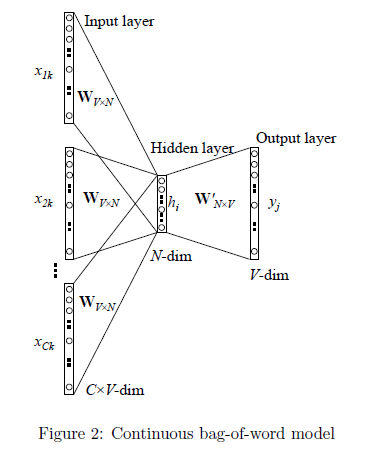
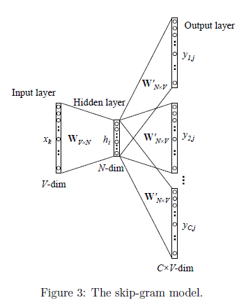

# MY NLP SUMMARY

我的自然语言处理NLP的学习内容汇总。

## Text Representation 文本表示

在自然语言之中，词语是最基础的结构之一，但是计算机无法直接对词语进行计算，所以需要一个方式对输入的句子进行预处理，使得计算机可以对它们进行计算。

因此，文本表示就是将非结构化不可计算的文本，转变成结构化可计算的数据的过程。其主要包含三种方法：
- One-Hot 独热编码
- 整数编码
- WordEmbedding

### 整数编码

直接使用整数进行编码，比如：

|分类|编码|
|---|---|
|猫|1|
|狗|2|
|人|3|

### One-Hot 独热编码

但是整数编码编码不好进行loss的计算，于是人们觉得可以用一个向量来表示文本，其中向量的每个位置下标对应一个分类，而对应的值则是分类的概率值，是则为1，不是则为0。这样上面的猫狗人的编码分别为：

|分类|编码|
|---|---|
|猫|[1, 0, 0 ]|
|狗|[0, 1, 0 ]|
|人|[0, 0, 1 ]|

最终形成了这样的类似HashTable的编码，每个编码只有对应位置上的值为1，其它都是0，于是称为One-Hot 独热编码。

并且模型的实际分类结果的输出也可以是这样子的向量，只是每个位上为分类的概率或者置信度，如模型预测结果为[0.1, 0.2, 0.85]则模型认为这个东西是猫的概率为0.1，狗为0.2，人为0.85，这样就可以和训练输入的编码对应上。

- 优点：独热编码解决了分类器不好处理属性数据的问题，在一定程度上也起到了扩充特征的作用。它的值只有0和1，不同的类型存储在垂直的空间。
- 缺点：当类别的数量很多时，特征空间会变得非常大。在这种情况下，一般可以用PCA来减少维度。而且one hot encoding+PCA这种组合在实际中也非常有用。

### WordEmbedding

但是之前的编码，特别是独热编码的长度非常长，所以我们有没有一种方法用一种比较短的方式来表示文本单词呢？

于是提出了Word Embedding，使用神经网络对文本进行学习，让网络提取其中的特征，从而得到词嵌入向量。

这样相似的词就有相似的特征，得到的向量也会相似。

词嵌入并不特指某个具体的算法，跟上面2种方式相比，这种方法有几个明显的优势：

- 他可以将文本通过一个低维向量来表达，不像 one-hot 那么长。
- 语意相似的词在向量空间上也会比较相近。
- 通用性很强，可以用在不同的任务中。

Word Embedding有两种主流算法，Word2Vec和Glove。

#### Word2Vec

Word2Vec是Google开源的一款用于词向量计算的工具。可以这样理解word2vec，它是一个计算词向量的工具，也是一种语言算法模型。

Word2Vec从结构上来说就是一个只有一个隐藏层的全连接网络，输入为单词的one-hot编码，输出为单词向量。

##### CBOW

CBOW（Continuous Bag of Words）模型是Word2Vec中的一个关键组件，主要用于通过上下文来预测目标词，即完型填空。

CBOW模型会选择一个窗口大小，输入的单词只会是这个窗口中除了要预测的单词的独热编码，或者随机初始化。

然后每个词进入隐藏层得到上下文向量，同时对这些向量进行平均（相加）得到最终的上下文向量。

最后经过softmax得到最终的输出结果，即预测词的概率分布，向量的每位表示是独热编码对应的词的概率。

- 优点：
  - 计算效率高：相比于另一种Word2Vec模型——Skip-gram，CBOW的计算效率更高，适合在大规模语料上训练。
  - 捕捉语境信息：CBOW通过上下文词来预测中心词，能较好地捕捉词汇的语境信息。
- 缺点：
  - 信息丢失：由于对上下文词进行平均操作，可能会丢失一些词序信息。
  - 不适合稀有词：CBOW对于频率较低的词的效果可能不如Skip-gram。

##### Skip-gram

Skip-gram模型是Word2Vec算法中的两种模型之一，它的核心思想是使用一个词（中心词）来预测它周围的词（上下文词）。

skip-gram的过程和CBOW相似，只不过是用一个词预测一个窗口的其它词，过程都是相似的。

##### 改进 Hierachival Softmax 和 Negative Sampling

Hierachival Softmax将输入到隐藏层的映射的方法由平均改为直接相加，用哈夫曼树代替原先的从隐藏层到输出层的矩阵，每个叶节点代表一个单词，从根节点到叶节点的路径为词向量。

最后预测输出向量时候，大小是1*V的向量，本质上是个多分类的问题。通过hierarchical softmax的技巧，把V分类的问题变成了log(V)次二分类。

在Word2Vec中，Negative Sampling模型是一种替代传统的Hierarchical Softmax的方法。它的核心思想是通过随机采样的方式，将多分类问题转化为一系列二分类问题，从而简化了计算过程。具体而言，对于给定的词w，它的上下文context(w)中的词被认为是正例，而其他词则被视为负例。然而，由于负例的数量非常庞大，我们不能直接对所有负例进行计算。因此，Negative Sampling模型通过随机采样的方式，从所有负例中选取一部分进行计算，从而降低了计算复杂度。

在Negative Sampling中，每个词w都对应一个负采样集合NEG(w)。这个集合中的词是从整个词汇表中随机采样的，但采样的概率与词频相关。高频词被选中的概率较大，而低频词被选中的概率较小。这种带权采样方法确保了高频词在训练中占据更重要的地位，同时也不会忽略低频词的影响。

#### GloVe

## 文本预处理

### Tokenize

### Vocabulary

## RNN

### RNN/LSTM/GRU

### Encoder-Decoder

### Seq2Seq

### 计划采样

### 束搜索

### 评估模型 BLEU/GLEU

## 注意力机制

### Attention 注意力机制

### Attention+Seq2Seq

## Transformer

### Self-Attention 自注意机制

### (Masked) Multi-Head Attention 多头注意力机制

### Position Encoding 位置编码

## LLM

### Bert

### GPT

## Reference 参考

[文本表示（Representation）](https://blog.csdn.net/qq_52785898/article/details/128080191)

[词嵌入 | Word embedding](https://easyai.tech/ai-definition/word-embedding/#2suanfa)

[Word2Vec模型之CBOW](https://www.cnblogs.com/chentiao/p/18353948)

[Word2Vec原理详解](https://www.cnblogs.com/lfri/p/15032919.html)

[Word Embedding中的负采样算法：深入解析Negative Sampling模型](https://developer.baidu.com/article/details/3271166)