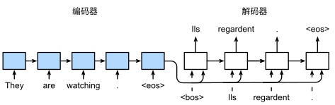

# RNN

循环神经网络（Recurrent Neural Network, RNN）是一类具有内部环状连接的人工神经网络，用于处理序列数据。其最大特点是网络中存在着环，使得信息能在网络中进行循环，实现对序列信息的存储和处理。

## 模型结构

首先我们来看RNN的网络结构，我们可以看出RNN和传统MLP的区别就是RNN有个自循环，而这个循环同时可以视为一个不断重复执行的模块，这个模块的输入有上个循环的结果 $H_{t-1}$ 和 传统MLP输入 $x_t$ ，输出则是 $H_t$ 。

而这个多出来的输入参数 $H_{t-1}$ 则被成为隐状态，即隐藏的状态，用于记录上个时间的信息。其方程如下：

$$
H_t=\phi(X_tW_{xh}+H_{t-1}W_{hh}+b_h)
$$

其中 $\phi$ 为激活函数一般为`tanh`函数， $X_t$ 为当前时刻输入， $H_{t-1}$ 为上一时刻隐状态， $W_{xh}$ 和 $W_{hh}$ 为权重矩阵， $b_h$ 为偏置。

由于在当前时间步中， 隐状态使用的定义与前一个时间步中使用的定义相同， 因此计算是循环的（recurrent）。 于是基于循环计算的隐状态神经网络被命名为循环神经网络（recurrent neural network）。 在循环神经网络中执行计算的层称为循环层（recurrent layer）。

而记录隐状态之后，还需要输出：

$$
O_t=H_tW_{hq}+b_q
$$

而输出则是当前隐状态值和权重的线性组合。

这样从公式看来，RNN和传统MLP相比就是多了个隐状态的线性组合。

此外需要注意的是，每个循环的各个权重矩阵和偏置都是相同的，变的部分只是输入和隐状态。

## 小结

- 优点
  - 能够处理不同长度的序列数据。
  - 能够捕捉序列中的时间依赖关系。
- 缺点
  - 对长序列的记忆能力较弱，可能出现梯度消失或梯度爆炸问题。
  - 训练可能相对复杂和时间消耗大。

***

# Long Short-Term Memory(LSTM)

长期以来，隐变量模型存在着长期信息保存和短期输入缺失的问题。 解决这一问题的最早方法之一是长短期记忆模型（long short-term memory，LSTM） (Hochreiter and Schmidhuber, 1997)。

## 模型结构

为了解决RNN的缺点即长期记忆弱和梯度消失的问题。LSTM引入了第二个隐状态 $C_{t-1}$ 用来保存上个时刻的长期记忆，其被称为记忆元(Memory Cell)。同时还受逻辑门的启发，设计了三个用于控制长期记忆的结构，遗忘门，输入门，输出门，分别用于控制长期记忆的遗忘，长期记忆的添加，模型的输出。

### 遗忘门

在数据输入LSTM的模块之后，第一步要进入的地方就是遗忘门。

在这里，我们通过短期记忆 $H_{t-1}$ 和输入 $X_t$ 共同决定要遗忘的长期记忆的比例。其求解公式如下：

$$
F_t=\sigma(X_tW_{xf}+H_{t-1}W_{hf}+b_f)
$$

也就是将短期记忆 $H_{t-1}$ 和输入 $X_t$ 进入线性层即乘上不同权重，然后结果通过sigmoid激活函数，得到遗忘门的输出 $F_t$ 。

最后将遗忘门的输出 $F_t$ 和长期记忆 $C_{t-1}$ 得到遗忘的结果 $C'_t$ 。

此时，由于遗忘门的结果是通过sigmoid激活函数处理过的，其取值范围在[0, 1]。

所以当遗忘门输出 $F_t$ 为1时长期记忆将维持不变， $F_t$ 为0时长期记忆的值将为0即完全遗忘。

所以遗忘门的输出 $F_t$ 就是控制长期记忆的记忆比例， $F_t$ 越高长期记忆记住的内容就越多。

### 输入门

接下来进入第二步，也就是输入门的过程。

这一步同样也是通过短期记忆 $H_{t-1}$ 和输入 $X_t$ 共同决定输入的内容。其公式如下:

$$
I_t=\sigma(X_tW_{xi}+H_{t-1}W_{hi}+b_i) \\
\tilde{C}_t=tanh(X_tW_{xc}+H_{t-1}W_{hc}+b_c)
$$

和遗忘门一模一样，就是线性层的参数矩阵和偏置不同。也就是将短期记忆 $H_{t-1}$ 和输入 $X_t$ 进入线性层即乘上不同权重，然后结果通过sigmoid激活函数，得到输入门的输出比例 $I_t$ 。

然后还需要引入一个候选记忆元，它的计算与上面描述的三个门的计算类似，但是使用`tanh`函数作为激活函数，它的作用是是要加入长期记忆的候选内容。

也就是将短期记忆 $H_{t-1}$ 和输入 $X_t$ 进入线性层即乘上不同权重，然后结果通过tanh激活函数，得到输入门的候选记忆元 $\tilde{C}_t$ 。

然后将输入门的输出比例 $I_t$ 和候选记忆元 $\tilde{C}_t$ 相乘，然后再和遗忘过后的长期记忆相加 $C'_t$ ，得到最后的长期记忆的结果。

于是整个模型的一个循环对长期记忆的修改就结束了，我们就可以根据遗忘门和输入门得到长期记忆的计算公式：

$$
C_t=F_t \odot C_{t-1} + I_t \odot \tilde{C}_t
$$

此时，由于输入门的输出 $I_t$ 是被sigmoid函数处理过的，其范围在[0, 1]之间，作为输入的阀门，控制要添加到长期记忆的内容的比例。

而候选记忆 $\tilde{C}_t$ 通过tanh处理，其范围在[-1, 1]之间，可以作为添加到长期记忆的内容。

于是二者相乘，并且和遗忘之后的长期记忆相加，就得到了新的长期记忆。

### 输出门

在长期记忆之后，我们不要忘了短期记忆和输出，所以在最后我们来到了输出门。

在这里，我们将通过之前的短期记忆 $H_{t-1}$ 和输入 $X_t$ 以及更新之后的长期记忆 $C_t$ 来共同决定这一循环的输出和短期记忆。

首先将短期记忆 $H_{t-1}$ 和输入 $X_t$ 进入线性层即乘上不同权重，然后结果通过sigmoid激活函数，得到输入门的输出 $O_t$ 。

然后将输出门的输出 $O_t$ 和经过tanh处理的长期记忆 $tanh(C_t)$ 相乘得到新的短期记忆 $H_t$ 。

$$
O_t=\sigma(X_tW_{xo}+H_{t-1}W_{ho}+b_o) \\
H_t=O_t \odot tanh(C_t)
$$

同样的，这里输出门的输出 $O_t$ 经过sigmoid函数，可以认为是新短期记忆的比例。

而长期记忆经过tanh函数得到的 $tanh(C_t)$ 则可以认为是新短期记忆的候选内容。

## 小结

LSTM的过程：
1. 长期记忆的遗忘（遗忘门）
2. 潜在长期记忆即候选记忆元的计算
3. 新长期记忆的形成（输入门）
4. 新短期记忆形成（输出门）

注意：
- LSTM本质上是一个RNN，它使用了遗忘门，输入门和输出门丰富（替换）了RNN循环中原来只有MLP+激活函数的内容。
- 这里只是介绍了LSTM的一层的结构，真正的神经网络由很多相同结构的循环组成。
- 不同门的权重W和偏置b是不同的，但是不同循环的相同门的权重是相同的。
- 一个规律：经过`sigmoid`的门一般用于控制比例，经过`tanh`的门一般用于控制内容。
- 长期记忆全程没有直接被权重W和偏置b修改过，使其不易发生梯度消失和梯度爆炸

优缺点：

LSTM通过引入复杂的门控机制解决了梯度消失的问题，使其能够捕获更长的序列依赖关系。然而，LSTM的复杂结构也使其在计算和参数方面相对昂贵。

***

# Gated Recurrent Unit(GRU)

门控循环单元（Gated Recurrent Unit，GRU）是一种特殊的RNN结构，由Cho等人于2014年提出。GRU与LSTM相似，但其结构更简单，计算效率更高。

## 模型结构

在GRU中，LSTM的输入门和输出门统一成了GRU中的更新门，LSTM中的遗忘门进化为了重置门。

LSTM中的两个隐状态长期记忆和短期记忆也被简化为了一个隐状态 $H_t$ 。

### 重置门

在GRU中，首先进入的地方就是重置门。

在这里，通过将之前的记忆 $H_{t-1}$ 和输入 $X_t$ 进入线性层即乘上不同权重，然后结果通过sigmoid激活函数，得到重置门的输出 $R_t$ 。

然后将重置门的输出 $R_t$ 和之前的记忆 $H_{t-1}$ 相乘，得到重置过后的记忆 $H'_t$ 。

然后将重置过后的记忆 $H'_t$ 和输入 $X_t$ 进入线性层即乘上不同权重，然后结果通过tanh激活函数，得到候选隐状态 $\tilde{H}_t$ 。

这一阶段的公式如下：

$$
R_t=\sigma(X_tW_{xr}+H_{t-1}W_{hr}+b_r) \\
\tilde{H}_t=tanh(X_tW_{xh}+(R_t \odot H_{t-1})W_{hh}+b_h)
$$

因此，重置门的主要作用就是用来重置之前的记忆，由 $H_{t-1}$ 和输入 $X_t$ 通过sigmoid共同决定遗忘的比例，然后再将比例和原来的记忆相乘通过tanh得到候选的记忆 $\tilde{H}_t$ 。

### 更新门

接下来就是通过更新门对隐状态进行更新和输出。

同样的通过将之前的记忆 $H_{t-1}$ 和输入 $X_t$ 进入线性层即乘上不同权重，然后结果通过sigmoid激活函数，得到更新门的输出 $Z_t$ 。

然后和之前的记忆 $H_{t-1}$ 相乘得到保留的记忆。

接下来就不一样了，由于更新的输出经过激活函数sigmoid，所以其范围为[0, 1]，所以用1减去它还是在[0, 1]。

然后使用1减去更新门的输出 $Z_t$ 乘上候选记忆 $\tilde{H}_t$ 加上保留的记忆得到最终结果 $H_t$ 。

这阶段的公式如下：

$$
Z_t=\sigma(X_tW_{xr}+H_{t-1}W_{hr}+b_r) \\
H_t=Z_t \odot H_{t-1} + (1-Z_t) \odot \tilde{H}_t
$$

因此，更新门的作用就是决定更新的比例， $Z_t$ 就是保留的记忆的比例， $(1-Z_t)$ 是更新的记忆的比例。

## 小结

- 门控循环神经网络可以更好地捕获时间步距离很长的序列上的依赖关系。
- 重置门有助于捕获序列中的短期依赖关系。
- 更新门有助于捕获序列中的长期依赖关系。
- 重置门打开时，门控循环单元包含基本循环神经网络；更新门打开时，门控循环单元可以跳过子序列。

***

# Encoder-Decoder

在RNN的一个运用场景机器翻译中，我们经常可以看到一串词即句子进行输入，然后一串词即翻译后的句子进行输出。这种输入输出都是一个序列，且长度不固定。对于这种seq2seq的需求，提出了Encoder-decoder编码器-解码器架构。

从Encoder-Decoder结构来看，它其实就是将输入使用Encoder进行“编码”，得到Encoder的输出一种状态，也叫Context Vector上下文向量，然后将这个状态输入到Decoder中进行“解码”得到具体的输出。

具体到seq2seq的运用场景中，从结构图中我们可以看见，Encoder和Decoder模块都是由RNN实现的，即两个相连的RNN。

在输入阶段，句子将一个词一个词输入到Encoder中，直到句子结束 <eos> 。

而在输出阶段，首先输入句子开头词源 <bos> ，然后Decoder通过输入 <bos> 和Encoder的结果得到第一个输出 lis。

然后在不断将输出作为输入，一个一个得到单词输出，直到得到句子结束次元 <eos>。

此外在训练阶段，Decoder的输入一般是固定的输入即预期结果，而推理阶段则是Decoder的上个输出。

## 小结 

- “编码器－解码器”架构可以将长度可变的序列作为输入和输出，因此适用于机器翻译等序列转换问题。
- 编码器将长度可变的序列作为输入，并将其转换为具有固定形状的编码状态。
- 解码器将具有固定形状的编码状态映射为长度可变的序列。

***

# 参考

[ML Lecture 21-1: Recurrent Neural Network (Part I)](https://www.youtube.com/watch?v=xCGidAeyS4M&ab_channel=Hung-yiLee) - 李宏毅教授的详细RNN和LSTM讲解

[LSTM（长短期记忆神经网络）最简单清晰的解释来了！](https://www.bilibili.com/video/BV1zD421N7nA/) - StatQuest
的RNN和LSTM讲解动画

[动手学深度学习](https://zh.d2l.ai/chapter_recurrent-neural-networks/rnn.html)

[循环神经网络RNN完全解析：从基础理论到PyTorch实战](https://cloud.tencent.com/developer/article/2348483)