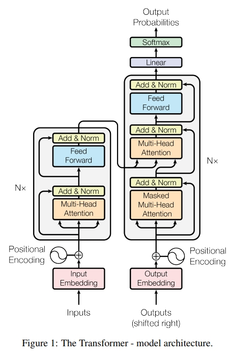
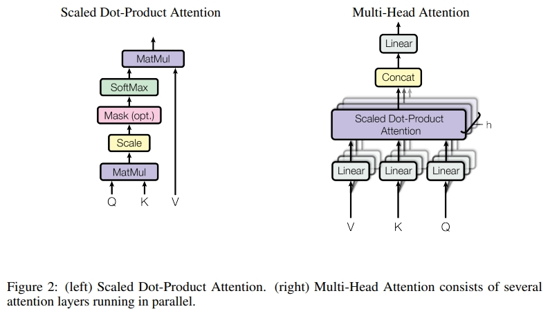

# transformer

这里是transformer相关学习笔记

论文[Attention Is All You Need](https://arxiv.org/abs/1706.03762)

在论文中，作者提出了一个全新的模型结构，用于提升RNN等传统模型并行处理能力弱的局限性。

于是就想论文题目那样，作者提出了以自注意力模式为主的，没有任何卷积层和循环层的模型结构，变形金刚transformer。

## 模型结构

从模型结构来看，模型主要由N个encoder编码器和N个decoder解码器组成。

模型总体流程为，输入转换成单词Embedding并和位置Embedding相加，然后输入到Encoder中。

在Encoder中，首先进入多头注意力模块的残差网络，然后FFN的残差网络，并且重复N次Encoder模块。

在Decoder中，输入都来自上一层decoder的输出，首先进入掩蔽多头注意力模块的残差网络，然后和encoder输出一起做一个多头注意力模块的残差网络，最后进入FFN前馈网络的残差网络，并且重复N次Decoder模块。

经过encoder和decoder之后，模型再通过一个全连接层和Softmax进行输出。

## 注意力机制

在transformer中，最重要的部分就是注意力机制。

从注意力的结构图中我们可以看到，输入被分成了Q，K，V，然后Q和K做MatMul点积，然后经过scale，mask和softmax之后再和V做MatMul点积就完成了一个注意力头，然后多个注意力头就组成了多头注意力机制。

这么看其实不能很清楚地了解它，接下来详细描述注意力机制的过程。

### Scaled Dot-Product Attention 缩放点注意力机制

我们称特定的注意力机制为“缩放点积注意力”。输入包括维度为dk的查询（queries）和键（keys），以及维度为dv的值（values）。我们计算查询与所有键的点积，每个点积结果都除以√dk，然后应用softmax函数，以得到值的权重。在实际操作中，我们同时对一组查询计算注意力函数，并将这些查询打包成一个矩阵Q。同样地，键和值也被打包成矩阵K和V。我们计算输出矩阵的公式如下：

$$Attention(Q,K,V)=softmax(\frac{QK^T}{\sqrt{d_k}})V$$

最常用的两种注意力函数是加性注意力和点积（乘性）注意力。点积注意力与我们的算法相同，除了缩放因子1/√dk。加性注意力使用一个带有单个隐藏层的前馈网络来计算兼容性函数。虽然两者在理论复杂度上相似，但点积注意力在实践中更快且空间效率更高，因为它可以使用高度优化的矩阵乘法代码实现。

对于较小的dk值，两种机制表现相似，但对于较大的dk值，加性注意力在没有缩放的情况下优于点积注意力[3]。我们怀疑，对于较大的dk值，点积的幅度会变得很大，使得softmax函数进入梯度极小的区域。为了抵消这种影响，我们将点积缩放为1/√dk。

#### 工作流程

首先就是Q，K和V三个输入向量，它是由输入向量X分别和权重矩阵$W_Q$和$W_K$和$W_V$相乘得到。

## 参考

[万字长文深度解读Transformer：《Attention is All You Need》——揭秘自注意力机制的革命性突破。](https://news.cafa.edu.cn/MobileNews/independenWeixinContent?contentId=225329199)

[动手学深度学习](https://zh.d2l.ai/chapter_attention-mechanisms/transformer.html)

[Transformer模型详解（图解最完整版）](https://zhuanlan.zhihu.com/p/338817680)

[直观解释注意力机制，Transformer的核心 | ](https://www.bilibili.com/video/BV1TZ421j7Ke/)

[Drawing the Transformer Network from Scratch (Part 1)](https://towardsdatascience.com/drawing-the-transformer-network-from-scratch-part-1-9269ed9a2c5e)