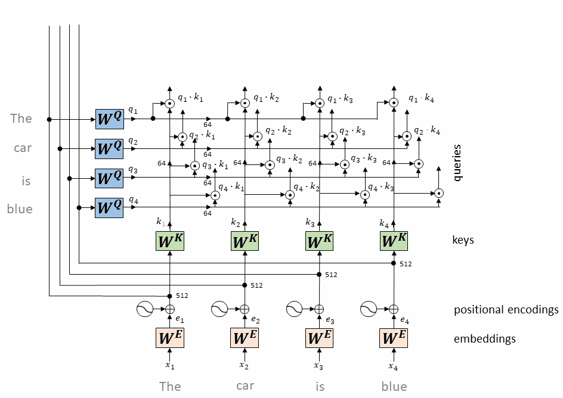

# transformer

这里是transformer相关学习笔记

论文[Attention Is All You Need](https://arxiv.org/abs/1706.03762)

在论文中，作者提出了一个全新的模型结构，用于提升RNN等传统模型并行处理能力弱的局限性。

于是就想论文题目那样，作者提出了以自注意力模式为主的，没有任何卷积层和循环层的模型结构，变形金刚transformer。

- [transformer](#transformer)
  - [模型结构](#模型结构)
  - [注意力机制](#注意力机制)
    - [Scaled Dot-Product Attention 缩放点注意力机制](#scaled-dot-product-attention-缩放点注意力机制)
      - [工作流程](#工作流程)
        - [并行机制](#并行机制)
    - [Multi-Head Attention 多头注意力机制](#multi-head-attention-多头注意力机制)
      - [工作流程](#工作流程-1)
  - [Embedding](#embedding)
    - [单词 Embedding](#单词-embedding)
    - [位置编码 Positional Encoding](#位置编码-positional-encoding)
  - [Encoder](#encoder)
    - [Add\&Norm](#addnorm)
    - [Feed Forward Network](#feed-forward-network)
  - [Decoder](#decoder)
    - [Masked Multi-Head Attention](#masked-multi-head-attention)
      - [原因](#原因)
      - [方法](#方法)
    - [Decoder's Multi-Head Attention](#decoders-multi-head-attention)
  - [参考](#参考)


## 模型结构


从模型结构来看，模型主要由N个encoder编码器和N个decoder解码器组成。

模型总体流程为，输入转换成单词Embedding并和位置Embedding相加，然后输入到Encoder中。

在Encoder中，首先进入多头注意力模块的残差网络，然后FFN的残差网络，并且重复N次Encoder模块。

在Decoder中，输入都来自上一层decoder的输出，首先进入掩蔽多头注意力模块的残差网络，然后和encoder输出一起做一个多头注意力模块的残差网络，最后进入FFN前馈网络的残差网络，并且重复N次Decoder模块。

经过encoder和decoder之后，模型再通过一个全连接层和Softmax进行输出。

***

## 注意力机制

在transformer中，最重要的部分就是注意力机制。


从注意力的结构图中我们可以看到，输入被分成了Q，K，V，然后Q和K做MatMul点积，然后经过scale，mask和softmax之后再和V做MatMul点积就完成了一个注意力头，然后多个注意力头就组成了多头注意力机制。

这么看其实不能很清楚地了解它，接下来详细描述注意力机制的过程。

### Scaled Dot-Product Attention 缩放点注意力机制

我们称特定的注意力机制为“缩放点积注意力”。输入包括维度为dk的查询（queries）和键（keys），以及维度为dv的值（values）。我们计算查询与所有键的点积，每个点积结果都除以 $\sqrt{d_k}$ ，然后应用softmax函数，以得到值的权重。

在实际操作中，我们同时对一组查询计算注意力函数，并将这些查询打包成一个矩阵Q。同样地，键和值也被打包成矩阵K和V。我们计算输出矩阵的公式如下：

$$Attention(Q,K,V)=softmax(\frac{QK^T}{\sqrt{d_k}})V$$

最常用的两种注意力函数是加性注意力和点积（乘性）注意力。点积注意力除了缩放因子 $\frac{1}{\sqrt{d_k}}$ 与点积算法相同。

加性注意力使用一个带有单个隐藏层的前馈网络来计算兼容性函数。虽然两者在理论复杂度上相似，但点积注意力在实践中更快且空间效率更高，因为它可以使用高度优化的矩阵乘法代码实现。

对于较小的dk值，两种机制表现相似，但对于较大的dk值，加性注意力在没有缩放的情况下优于点积注意力。我们怀疑，对于较大的dk值，点积的结果会变得很大，使得softmax函数进入梯度极小的区域。为了抵消这种影响，我们将点积缩放为 $\frac{1}{\sqrt{d_k}}$ 。

#### 工作流程

首先就是Q，K和V三个输入向量，它是由输入向量X分别和权重矩阵 $W_Q$ 和 $W_K$ 和 $W_V$ 相乘得到。


将输入的单词对应的向量 $x_i$ 和矩阵 $W_Q$ 和 $W_K$ 和 $W_V$ 得到向量 $Q_i$ 和 $K_i$ 和 $V_i$ 。


然后将 $Q_1$ 和 $K_i$ 分别做点积。

这个步骤是在所有token之间建立关系，表示每个token对其他token的“关注”程度。

这个过程我们可以看出使每个单词token的Query向量在对其它单词询问“我们之间有没有关系”，然后被询问的单词使用Key向量进行回复，然后 $Q_i$ 和 $K_i$ 的点积结果就可以视为“关注”程度，即注意力注意的地方。




接下来我们对所有的 $Q_i$ 和 $K_i$ 都做点积，将结果通过scale(除以 $\sqrt{d_k}$ 根号维度大小)和softmax之后的成注意力权重构成了一个Attention矩阵。

这个矩阵的每一行对应一个token，每一列也对应一个token，矩阵中的每个元素表示了对应行token对列token的注意力权重。


接下来将Attention矩阵和$V_i$相乘，就能得到缩放点注意力机制的输出。

##### 并行机制

而将所有的 $X_i$ 组成X矩阵，然后将其和 $W_Q$ 和 $W_K$ 和 $W_V$ 相乘就能得到W，K和V矩阵，它们的值由 $Q_i$ 和 $K_i$ 和 $V_i$ 组成。

然后根据之前的计算机制和优化的矩阵乘法，就可以并行计算之前介绍的计算过程了。

### Multi-Head Attention 多头注意力机制

多头注意力机制通过并行执行多个注意力函数，并在不同表示子空间中捕获信息，提高了模型的表达能力和性能。

多头注意力模型公式如下

```math
MutilHead(Q,K,V)=Concat(head_1,...,head_h)W^O
```
```math
where\ head_i=Attention(QW_i^Q,KW_i^K,VW_i^V)
```
```math
W_i^Q\in\mathbb{R}^{d_{model}xd_k},W_i^K\in\mathbb{R}^{d_{model}xd_k},W_i^V\in\mathbb{R}^{d_{model}xd_k}
```

- 多头注意力机制：我们采用多头注意力机制，而不是单一的注意力函数。这意味着查询、键和值分别通过多个不同的线性投影进行映射，每个投影对应一个“头”。
- 并行执行：在每个投影后的查询、键和值版本上，我们并行执行注意力函数，从而得到多个输出值。
- 输出值处理：这些并行计算得到的输出值被拼接起来，并经过一次额外的线性投影，得到最终的输出值。
- 参数矩阵：投影过程是通过一系列参数矩阵实现的，这些矩阵包括 $W_i^Q$ 、 $W_i^K$ 、 $W_i^V$ 和 $W^O$ ，它们分别对应查询、键、值和输出的投影。
- 头的数量与维度：在这项工作中，我们使用了8个并行的注意力头（h=8）。每个头的维度（dk和dv）被设置为模型维度（dmodel）除以头的数量，即64。
- 计算成本：由于每个头的维度较低，尽管有多头并行处理，但总的计算成本与全维度的单头注意力相似。
- 优势：多头注意力允许模型在不同的表示子空间中联合关注不同位置的信息，从而提高了模型的表达能力和性能。而使用单个注意力头时，平均操作可能会抑制这种能力。

#### 工作流程


由公式和模型结构可见，多头注意力机制本质上就是用多个注意力机制头对输入进行处理，然后将输出拼接在一起，并且和矩阵$W^O$相乘得到最终的输出结果

***

## Embedding

### 单词 Embedding

单词的 Embedding 有很多种方式可以获取，例如可以采用 Word2Vec、Glove 等算法预训练得到，也可以在 Transformer 中训练得到。

### 位置编码 Positional Encoding

Transformer不像RNN那样的循环结构有不同的时间先后顺序，所有输入和推理是并行的。因此为了充分利用输入中的位置信息，作者需要注入一些相对和绝对的位置信息。于是作者引入了位置编码，他有和输入相同的维度大小，并且和输入的Embedding相加。

位置编码有很多种实现方法，可以由神经网络实现，也可以通过公式实现：

$$
PE_{(pos,2i)}=sin(pos/10000^{2i/d_{model} }) \\
PE_{(pos,2i+1)}=cos(pos/10000^{2i/d_{model} })
$$

其中，pos 表示单词在句子中的位置，d 表示 PE的维度 (与词 Embedding 一样)，2i 表示偶数的维度，2i+1 表示奇数维度 (即 2i≤d, 2i+1≤d)。使用这种公式计算 PE 有以下的好处：

- 使 PE 能够适应比训练集里面所有句子更长的句子，假设训练集里面最长的句子是有 20 个单词，突然来了一个长度为 21 的句子，则使用公式计算的方法可以计算出第 21 位的 Embedding。
- 可以让模型容易地计算出相对位置，对于固定长度的间距 k，PE(pos+k) 可以用 PE(pos) 计算得到。因为 Sin(A+B) = Sin(A)Cos(B) + Cos(A)Sin(B), Cos(A+B) = Cos(A)Cos(B) - Sin(A)Sin(B)。

将单词的词 Embedding 和位置 Embedding 相加，就可以得到单词的表示向量 x，x 就是 Transformer 的输入。

***

## Encoder


从结构图中，我们可以看到Encoder是由Multi-Head Attention模块，Add&Norm模块，Feed Forward模块组成。并且一般都是多个Encoder模块进行叠加来增强效果。

其中我们已经了解了Multi-Head Attention模块，接下来介绍Add&Norm模块和Feed Forward模块。

### Add&Norm

Add其实就是残差相加，Norm表示Layer Normalization层归一化。其公式如下：

$$y=LayerNorm(x+Sublayer(x))$$

其中sublayer表示MHA多头注意力层或者FFN前馈神经网络等。

x+Sublayer(x)表示残差连接，通常用于解决多层网络训练的问题，可以让网络只关注当前差异的部分。

Norm指Layer Normalization，通常用于RNN结构，Layer Normalization会将每一层神经元的输入都转成均值方差都一样的，这样可以加快收敛。

### Feed Forward Network

Feed Forward Network前馈神经网络其实就是一个两层的全连接层，第一层的激活函数为ReLU，第二层不使用激活函数。

$$FFN(x)=max(0,xW_1+b_1)W_2+b_2$$

***

## Decoder


从结构图中，我们可以看到Decoder是由Multi-Head Attention模块，Masked Multi-Head Attention模块，Add&Norm模块，Feed Forward模块组成。并且一般都是多个Decoder模块进行叠加来增强效果。

接下来介绍Decoder中和之前的不同之处，即Masked Multi-Head Attention模块和Multi-Head Attention模块的输入。

### Masked Multi-Head Attention

#### 原因

Masked Multi-Head Attention相对于普通的MHA来说只是在上面运用了Mask掩码，那么我们为什么要在上面运用掩码呢？

首先对一个MHA而言，其公式如下：

$$Attention(Q,K,V)=softmax(\frac{QK^T}{\sqrt{d_k}})V$$

得到的注意力矩阵Attention的每一行分别是一个单词token对另外一个单词的注意力向量即 $Q_i$ 和 $K_j$ 的点积和 $V_j$ 的乘积。比如我们的输入为`Machine Learning is fun`，其Attention矩阵中第二行第三列的值为Learning对is的注意力值。

接下来我们看transformer的执行过程，同样以`Machine Learning is fun`的翻译为例，其中`<bos>`和`<eos>`为开始和结束的标识符。

> 首先整句进入Encoder模块，得到Encoder处理结果`Memory`。
>
> 然后Encoder的结果`Memory`和Decoder的历史输出作为Decoder的输入。
>
> 比如首次输入为`Memory`和`<bos>`，输出第一个词的翻译结果`机`。
>
> 然后将输出的结果和之前的组合再次输入即输入`Memory`和`<bos> 机`，输出第二次的翻译结果`机器`。
>
> 然后输入`Memory`和`<bos> 机器`，输出第二次的翻译结果`机器学习`。
>
> Decoder会不断重复这个过程，直到翻译完成。即最后一次输输入`Memory`和`<bos> 机器学习真好玩`，输出`<eos>`。

在这个过程中，我们可以看到，其实在输出`机器学习`时，它只有之前的单词`Machine`和`Learning`的注意力信息。

但是我们的Encoder得到的结果是有全部的单词token之间的注意力信息的，所以为了让这个单词“学习”不能看到后面的字“真好玩”，所以要运用掩码Mask。其原因是如果让单词“学习”看到了后面的字，那么它的编码就会发生变化，相当于被剧透了，从而影响模型的预测能力。

#### 方法

对于Masked Multi-Head Attention，其实现方法和MHA大体上是相同的，对每个注意力头，首先都是将输入X和相权重矩阵相乘得到Q，K和V三个矩阵。然后计算 $QK^T$ 得到基础的注意力矩阵。


接下来我们使用Mask矩阵和 $QK^T$ 按位相乘，然后进行Softmax就可以得到加了掩码的矩阵。


其中Mask矩阵要掩蔽的地方即这个单词和后面的单词的注意力信息的地方设置为`0`，这样在按位相乘之后需要掩蔽的地方就都为0了，即注意力值为0。但是实际过程和代码中，我们都使用的 $-\infty$ ，因为在这之后会经过一次Softmax处理，处理过后 $-\infty$ 就变成了0。

```python
if mask is not None:
    scores = scores.masked_fill(mask == 0, -1e9)

p_attn = scores.softmax(dim=-1)
```

之后的过程和普通的MHA一样，将结果和Value矩阵相乘得到输出。


### Decoder's Multi-Head Attention

Decoder block 第二个 Multi-Head Attention 变化不大， 主要的区别在于其中 Self-Attention 的 K, V矩阵不是使用 上一个 Decoder block 的输出计算的，而是使用 Encoder 的编码信息矩阵 C 计算的。

根据 Encoder 的输出 C计算得到 K, V，根据上一个 Decoder block 的输出 Z 计算 Q (如果是第一个 Decoder block 则使用输入矩阵 X 进行计算)，后续的计算方法与之前描述的一致。

这样做的好处是在 Decoder 的时候，每一位单词都可以利用到 Encoder 所有单词的信息 (这些信息无需 Mask)。

***

## 参考

[万字长文深度解读Transformer：《Attention is All You Need》——揭秘自注意力机制的革命性突破。](https://news.cafa.edu.cn/MobileNews/independenWeixinContent?contentId=225329199)

[动手学深度学习](https://zh.d2l.ai/chapter_attention-mechanisms/transformer.html)

[Transformer模型详解（图解最完整版）](https://zhuanlan.zhihu.com/p/338817680)

[直观解释注意力机制，Transformer的核心 | ](https://www.bilibili.com/video/BV1TZ421j7Ke/)

[Drawing the Transformer Network from Scratch (Part 1)](https://towardsdatascience.com/drawing-the-transformer-network-from-scratch-part-1-9269ed9a2c5e)

[层层剖析，让你彻底搞懂Self-Attention、MultiHead-Attention和Masked-Attention的机制和原理](https://blog.csdn.net/zhaohongfei_358/article/details/122861751)
