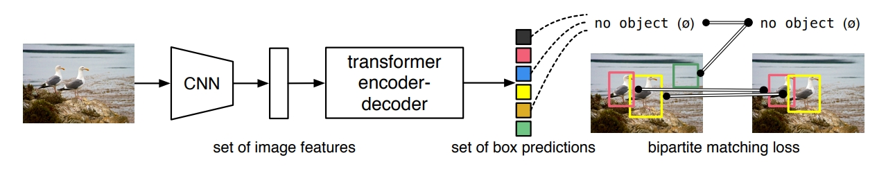
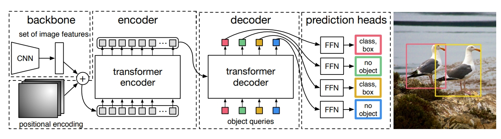
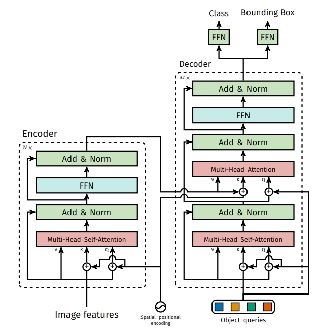
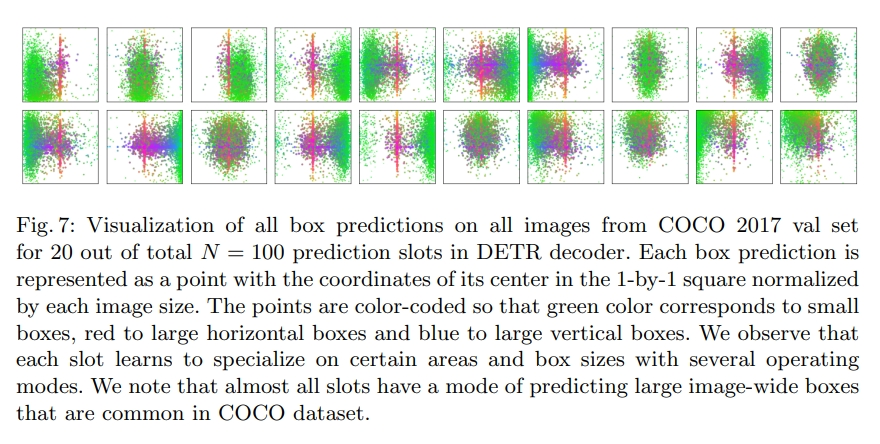

# DETR

论文[End-to-End Object Detection with Transformers](https://arxiv.org/abs/2005.12872)

DETR全程为Detection Transformer，如其名是一个在目标检测上运用transformer的模型。

文章所做的工作，就是将transformers运用到了object detection领域，取代了现在的模型需要手工设计的工作，并且取得了不错的结果。主要是取消NMS等后处理，和锚框等先验知识的手工过程。



上图可以直接看出模型主要的流程设计：

1. CNN提取特征并拉直
2. 全局建模，给到transformer-encoder去进一步学习全局信息
3. 通过不带掩码机制的transformer-decoder生成很多预测框
4. 预测框和真实框做二分图匹配，训练时计算loss去除多余背景框，推理时无需这步可以直接使用阈值去除多余框。

## 模型结构



可以看出模型主要是由backbone，encoder，decoder，prediction heads四部分组成。

### backbone

backbone可以是大部分目标检测的CNN主干模型，作者使用ResNet50。

一个例子，图片输入为3x800x1066，经过CNN卷积之后得到2048x25x34(c,h,w)的特征图，然后作者使用1x1卷积降维为256x25x34(d,h,w)方便进入transformer进行相关处理。

### encoder



encoder部分为transformer-encoder，相关的模型内容和transformer是相同的，每个encoder块都是由多头自注意模块和FFN组成。

只在输入前加入了位置编码使transformer可以获得其本身无法获得的相关的位置信息。

位置编码是一个固定的256x25x34(d,h,w)，使其可以和之前卷积出的特征图相加。

相加之后将向量的h和w拉直成850x256(hw,d)的向量，将其输入到transformer-encoder中，输出850x256的结果。

其中DETR中使用了6层encoder。

### decoder

在decoder部分，作者在transformer基础的自注意力和FFN结构的decoder上，加入了object queries的learnable positional embedding，做cross attention。

下图是作者将object query经过COCO训练集后进行可视化的结构，绿色为小框中心点，红色为横向框中心点，蓝色为纵向框中心点。

从中我们可以窥见object query做的工作其实就是询问encoder的输出中有没有对应的框，比如我的绿色部分有小物体吗，红色部分有大的横向物体吗。100个query就有100种问问题方式进行询问，然后根据询问结果进行decoder的输出。此外我们还可以看到几乎每个query中间都有红色的点，作者认为这是数据集中间总是有一个大物体的训练结果。



object queries为100x256(n,b)即要生成的100个目标的框和输入张量的256的长度。将其和encoder输出的850x256的向量做自注意力和FFN的操作，得到decoder的输出为100x256的向量。

其中DETR中使用了6层decoder。

### prediction head

检测头部分则是FFN来预测分类和框，且DETR中生成100个框，所以检测头也有100个。其输出为100x91即100个框和class+1个分类的向量。

## 损失函数

DETR默认会输出N个输出，无论有多少物体都会输出N个，默认为100个。

但是这么多输出组成的输出集怎么计算loss呢，于是作者将其转换成二分图匹配的问题。二分图匹配的问题可以认为是如何分配工人和工作使最终的开销最小的问题，像匈牙利算法就是一个高效的解决算法。

而目标检测也是这种二分图匹配的问题，把预测框和真实框看成二分图的两个部分，使其准确度最高。而这种方法和之前的anchor box的loss是差不多的，只不过之前的约束更弱，为一对多的框，而这里二分图问题则是一对一的框，从而解决了NMS的问题。

作者最终选择了匈牙利算法计算损失函数，也分为分类loss和bbox loss。

接下来我们把第i个值的ground-true值表示为 $y_i=(c_i,b_i)$ ，其中 $c_i$ 为分类class值， $b_i$ 为bounding box的值。并且定义 $\hat{y}_i$ 为对应的预测值。

由匈牙利算法，第i个GT值对应的 $\sigma(i)$ 为匈牙利算法得到的预测值的索引，即和第i个真实值最接近的预测框为第 $\sigma(i)$ 个预测框。

由匈牙利算法得到下面的公式：

```math
\hat{\sigma}=\argmin_{\sigma\in\mathfrak{G}_N}\sum\limits_{i}^{N}\mathcal{L}_{macth}(y_i,\hat{y}_{\sigma(i)})
```

即对于某一个真值 $y_i$ ，假设我们已经找到这个真值对应的预测值 $\hat{y}_{\sigma(i)}$ ，这里的 $\mathfrak{G}_N$ 是所有可能的排列，代表从真值索引到预测值索引的所有的映射，然后用 $\mathcal{L}_{macth}$ 最小化 $y_i$ 和 $\hat{y}_{\sigma(i)}$ 的距离。

其中 $\mathcal{L}_{macth}$ 具体是：

```math
\mathcal{L}_{match}=-\mathbb{1}_{\{c_i\ne\varnothing\}}\hat{p}_{\sigma(i)}(c_i)+\mathbb{1}_{\{c_i\ne\varnothing\}}\mathcal{L}_{box}(b_i,\hat{b}_{\sigma(i)})
```

前半部分为分类部分，后半部分为回归部分，分别为分类的预测值 $\hat{p}_{\sigma(i)}(c_i)$ 

和回归的预测值和真实值的差异 $\mathcal{L}_{box}(b_i,\hat{b}_{\sigma(i)})$ 。

此外 $\mathbb{1}_{\{c_i\ne\varnothing\}}$ 表示匹配上时才取这个值，没有匹配上则取0忽略整个式子。

而 $\mathcal{L}_{macth}$ 则使用`scipy.optimize`这个库中的`linear_sum_assignment`函数即匈牙利算法的实现获得。

这么看来其实损失函数和其它的目标检测算法差不多，只是其它的是真实框和目标框一对多匹配，而这里是一对一匹配。

综合上面的公式，我们得到最终的公式：

```math
\mathcal{L}_{Hungarian}(y,\hat{y})=\sum\limits_{i=1}^{N}[-log\hat{p}_{\hat{\sigma}(i)}(c_i)+1_{\{c_i\ne\varnothing\}}\mathcal{L}_{box}(b_i,\hat{b}_{\hat{\sigma}}(i))]
```

## 代码

在论文的最后，作者给出了DETR的伪代码，其实就是pytorch的代码。

```python
import torch
from torch import nn
from torchvision.models import resnet50

class DETR(nn.Module):

def __init__(self, num_classes, hidden_dim, nheads,
num_encoder_layers, num_decoder_layers):
super().__init__()
# We take only convolutional layers from ResNet-50 model
self.backbone = nn.Sequential(*list(resnet50(pretrained=True).children())[:-2])
self.conv = nn.Conv2d(2048, hidden_dim, 1)
self.transformer = nn.Transformer(hidden_dim, nheads,
num_encoder_layers, num_decoder_layers)
self.linear_class = nn.Linear(hidden_dim, num_classes + 1)
self.linear_bbox = nn.Linear(hidden_dim, 4)
self.query_pos = nn.Parameter(torch.rand(100, hidden_dim))
self.row_embed = nn.Parameter(torch.rand(50, hidden_dim // 2))
self.col_embed = nn.Parameter(torch.rand(50, hidden_dim // 2))

def forward(self, inputs):
x = self.backbone(inputs)
h = self.conv(x)
H, W = h.shape[-2:]
pos = torch.cat([
self.col_embed[:W].unsqueeze(0).repeat(H, 1, 1),
self.row_embed[:H].unsqueeze(1).repeat(1, W, 1),
], dim=-1).flatten(0, 1).unsqueeze(1)
h = self.transformer(pos + h.flatten(2).permute(2, 0, 1),
self.query_pos.unsqueeze(1))
return self.linear_class(h), self.linear_bbox(h).sigmoid()

detr = DETR(num_classes=91, hidden_dim=256, nheads=8, num_encoder_layers=6, num_decoder_layers=6)
detr.eval()
inputs = torch.randn(1, 3, 800, 1200)
logits, bboxes = detr(inputs)
```

在初始化内容中，指定了backbone为resnet50，然后指定投射层conv，以及transformer和检测头的全连接层FFN，以及query object和位置编码embedding。

其中参数num_classes为分类数，hidden_dim为transformer的hidden dimension，nheads为多头注意力的数量，num_encoder_layers和num_decoder_layers为encoder和decoder的层数。

在forward正向传播部分，我们可以看到这里的过程和之前模型的执行过程相同，首先卷积得到特征，然后resize特征向量和位置编码相加，然后进入transformer部分，最后进入FNN输出。

最后，再构建模型实例，进行相关训练或者推理即可。

在此可见，这个模型确如作者所说非常简单，其代码也是50多行就可以了，简单但是有效且有力。

## 参考

[DETR 论文精读【论文精读】](https://www.bilibili.com/video/BV1GB4y1X72R/)

[图像生成发展起源：从VAE、VQ-VAE、扩散模型DDPM、DETR到ViT、Swin transformer](https://blog.csdn.net/v_JULY_v/article/details/130361959)

[Vision Transformer 超详细解读 (原理分析+代码解读) (一)](https://zhuanlan.zhihu.com/p/340149804)